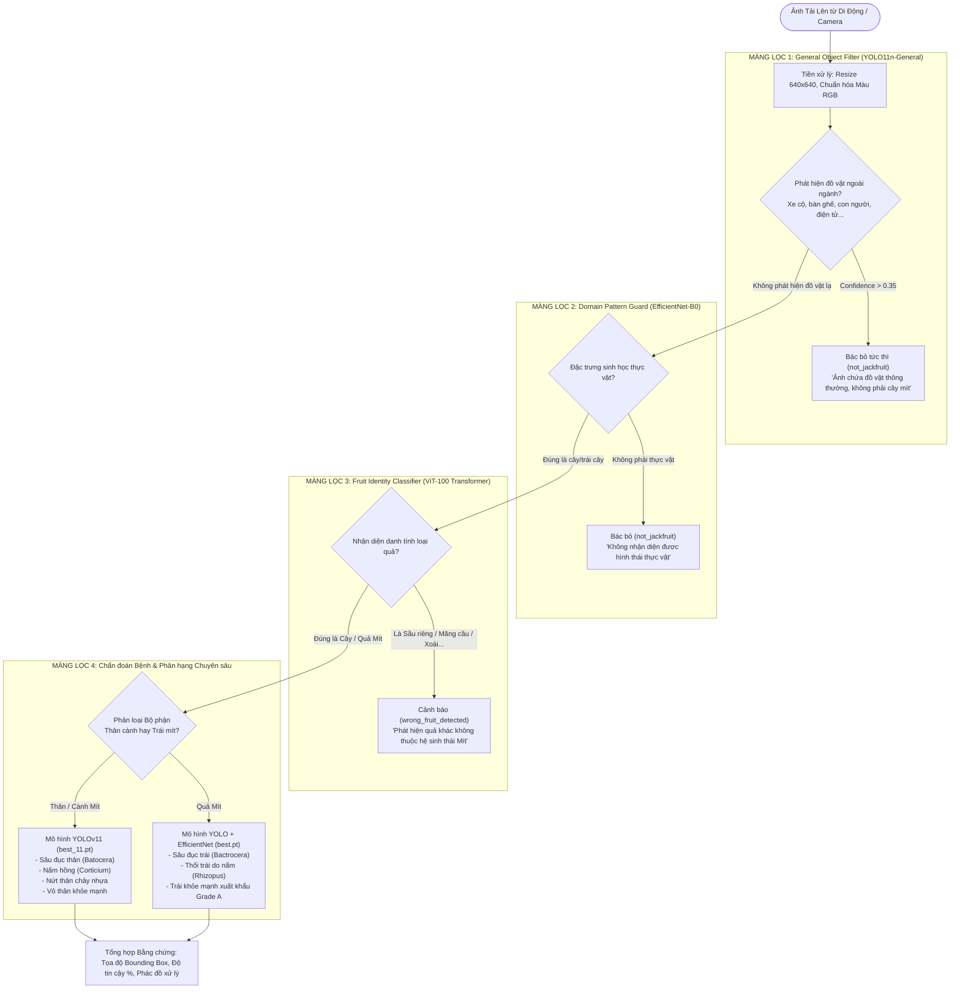

# AI VISION & DECISION SUPPORT ARCHITECTURE — TAM MỸ SMART FRUIT ECOSYSTEM
## 4-TIER GUARD PIPELINE, SERVICE ISOLATION & DECISION SUPPORT SYSTEM

> **Tài liệu Kiến trúc Trí tuệ Nhân tạo & Thị giác Máy tính (AI Specification)**  
> **Phiên bản:** 2.0.0-PROD  
> **Nguyên tắc cốt lõi:** AI là công cụ hỗ trợ ra quyết định & tạo bằng chứng — Không tự động trở thành chân lý  

---

## 1. NGUYÊN TẮC CỐT LÕI CỦA PHÂN HỆ AI (AI SYSTEM PRINCIPLES)

1. **AI là Nguồn Bằng chứng & Tín hiệu Rủi ro (Evidence & Risk Signal):** Kết quả suy luận của mô hình AI cung cấp thông tin tham vấn, độ tin cậy phần trăm và phác đồ khuyến nghị cho Kỹ thuật viên / QA; AI **không bao giờ tự động ghi đè hoặc phê duyệt trạng thái chính thức** của lô hàng nếu chưa có sự xác nhận của con người.
2. **Cô lập Dịch vụ AI (AI Service Isolation):** Phân hệ AI chạy dưới dạng một dịch vụ độc lập (`AI Engine Container`) tối ưu hóa tính toán GPU (CUDA / PyTorch), tách biệt hoàn toàn với Core Business API để ngăn chặn việc tải nặng suy luận làm chậm các giao dịch chuỗi cung ứng.
3. **Bảo toàn Xuất xứ Suy luận (Inference Provenance):** Mọi kết quả AI đều lưu trữ phiên bản mô hình (`model_version`), hàm băm trọng số (`weights_sha256`), mã băm ảnh đầu vào (`image_sha256`) và thời gian thực hiện.

---

## 2. QUY TRÌNH 4 MÀNG LỌC CHỐNG DƯƠNG TÍNH GIẢ (4-TIER GUARD PIPELINE)



---

## 3. CƠ CHẾ DỰ PHÒNG KHI DỊCH VỤ AI GẶP SỰ CỐ (GRACEFUL DEGRADATION)

Nếu dịch vụ AI tạm thời mất kết nối (GPU bảo trì / quá tải):
- **Luồng vận hành chuỗi cung ứng KHÔNG BỊ GIÁN ĐOẠN:** Người dùng vẫn có thể chụp ảnh và tải lên bình thường.
- Dữ liệu hình ảnh được lưu trữ an toàn trên Object Storage, công việc suy luận được đẩy vào hàng đợi `queue:ai-inference` để tự động xử lý bù khi dịch vụ AI hồi phục.
- Trạng thái kiểm định hiển thị `PENDING_AI_ANALYSIS`, cho phép Kỹ thuật viên thực địa dùng mắt thường để tạm duyệt bước tiếp theo nếu có biên bản giấy.

---

## 4. QUẢN LÝ PHIÊN BẢN MÔ HÌNH (MODEL REGISTRY SCHEMA)

```sql
CREATE TABLE ai_model_registry (
    id UUID PRIMARY KEY DEFAULT gen_random_uuid(),
    model_name VARCHAR(80) NOT NULL, -- yolo11_tree_disease, vit100_fruit_classifier, fruit_disease_yolo
    version_tag VARCHAR(30) NOT NULL, -- v1.0.0-prod, v1.2.0-hotfix
    framework VARCHAR(40) NOT NULL, -- PyTorch, Ultralytics, Transformers
    weights_storage_key VARCHAR(255) NOT NULL,
    weights_sha256 CHAR(64) NOT NULL,
    input_resolution VARCHAR(20) DEFAULT '640x640',
    min_confidence_threshold NUMERIC(4,3) DEFAULT 0.700,
    is_active BOOLEAN DEFAULT TRUE,
    deployed_at TIMESTAMPTZ DEFAULT CURRENT_TIMESTAMP
);
```
