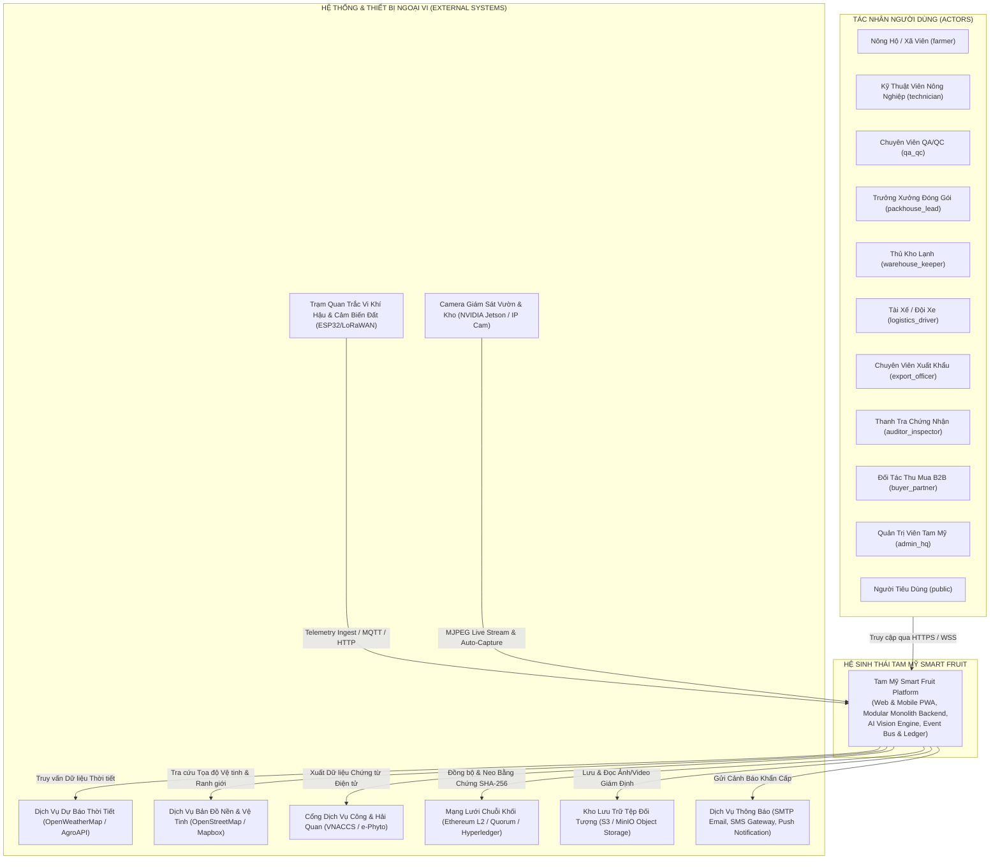
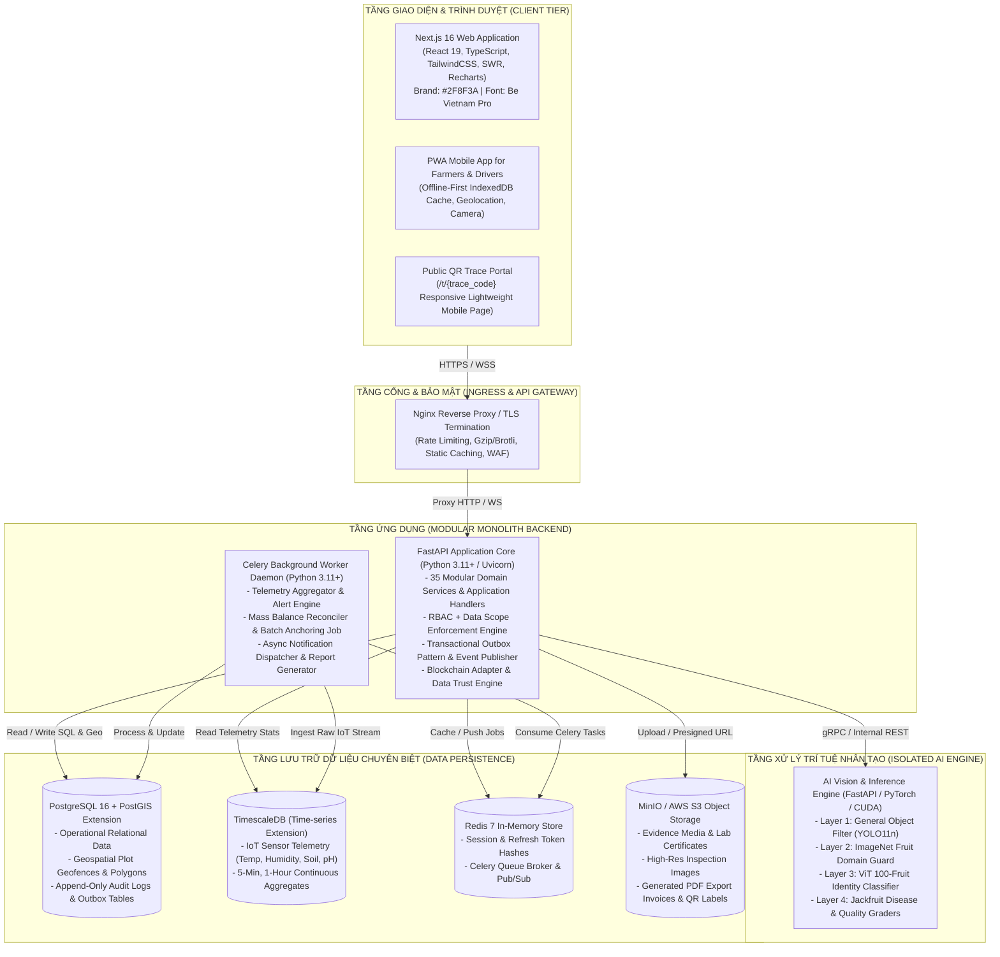

# SYSTEM ARCHITECTURE BLUEPRINT — TAM MỸ SMART FRUIT ECOSYSTEM
## PRODUCTION-GRADE AGRICULTURAL DIGITAL OPERATIONS & SUPPLY CHAIN PLATFORM

> **Tài liệu Kiến trúc Hệ thống Chuẩn (Authoritative System Architecture)**  
> **Phiên bản:** 2.1.0-PROD  
> **Trạng thái:** Thiết kế Kỹ thuật Chính thức Phase 2 (Authoritative Technical Blueprint)  
> **Nguyên tắc cốt lõi:** Modular Monolith First | Domain-Driven Design | Data Trust Invariants | 100% Bilingual VI/EN  

---

## 1. NGUYÊN TẮC THIẾT KẾ KIẾN TRÚC (ARCHITECTURAL PRINCIPLES)

1. **Modular Monolith First**: Toàn bộ 35 modules nghiệp vụ vận hành chuỗi cung ứng được cấu trúc độc lập trong một codebase duy nhất, giao tiếp qua Public Domain Services và Domain Events nội bộ. Không chia nhỏ thành microservices phân tán khi chưa có nhu cầu độc lập về scale hoặc team.
2. **Business Process First & System Inheritance**: Luồng nghiệp vụ quyết định giao diện. Dữ liệu đã được thẩm định ở thượng nguồn (`Upstream`) bắt buộc tự động kế thừa ở hạ nguồn (`Downstream`), cấm nhập lại bằng tay.
3. **Data Trust & Selective Blockchain Anchoring**: Blockchain là tầng bảo vệ tính toàn vẹn (Integrity Layer), không thay thế database. Tuyệt đối không neo dữ liệu thô do người dùng tự khai. Mọi dữ liệu neo chuỗi khối bắt buộc đi qua Pipeline 7 bước và chỉ neo khi phát sinh sự kiện `BlockchainAnchorEligibleEvent`.
4. **Bảo toàn Phả hệ (Traceability DAG Projection) & Cân bằng Khối lượng (Mass Balance)**: 
   - Đồ thị Truy xuất nguồn gốc là một **Read-Optimized Projection** sinh từ Domain Events bất biến.
   - Kiểm soát sai số bảo toàn khối lượng hai chiều tại mọi khâu chuyển đổi:
     $$\left| \text{Total Input} - (\text{Total Output} + \text{Total Loss} + \text{Total Reject}) \right| \le \text{Total Input} \times \text{Configured\_Tolerance}$$
5. **Backend-Enforced Security & Multi-Tenancy**: Kiểm tra phân quyền đa cấp (`Role + Action + Data Scope`) trực tiếp tại Application Services trên Backend; cấm dựa vào việc ẩn nút bấm trên Frontend.
6. **Kiến trúc Song ngữ VI/EN Độc lập**: 100% văn bản giao diện và thông điệp hệ thống phân tách qua tệp từ điển JSON, cơ sở dữ liệu dùng mã định danh chuẩn (Code-based enums).
7. **Bất biến Lịch sử (Never Overwrite History)**: Dữ liệu đã phê duyệt chỉ có thể tạo bản ghi đính chính (`CORRECTION`), bản ghi cũ giữ nguyên trạng thái `SUPERSEDED` và lưu vào nhật ký kiểm toán Append-Only.

---

## 2. SƠ ĐỒ BỐI CẢNH HỆ THỐNG (SYSTEM CONTEXT - C4 LEVEL 1)



---

## 3. SƠ ĐỒ CONTAINER HỆ THỐNG (CONTAINER ARCHITECTURE - C4 LEVEL 2)



---

## 4. BẢN ĐỒ MIỀN CHUẨN TẮC & CÁC MODULE CHÍNH THỨC (CANONICAL 35 MODULE MAP)

Hệ sinh thái được phân chia thành **đúng 35 Modules chuẩn tắc**, thuộc 4 nhóm chức năng:

| Nhóm Miền (Domain Group) | Danh sách 35 Modules Chính thức | Trách nhiệm Nghiệp vụ Cốt lõi |
| :--- | :--- | :--- |
| **I. Foundation & Core Identity** (4 Modules) | `IdentityModule`, `OrganizationModule`, `MasterDataModule`, `ConfigurationModule` | Xác thực JWT/Argon2id, quản lý đa tổ chức, phân quyền RBAC + Data Scope, danh mục dữ liệu chủ song ngữ VI/EN có phiên bản. |
| **II. Farm & Agronomy (Upstream)** (9 Modules) | `GrowingAreaModule`, `FarmModule`, `PlotModule`, `SeasonModule`, `ActivityModule`, `MaterialModule`, `IoTModule`, `MediaModule`, `AIModule` | Quản lý không gian địa lý PostGIS, chu kỳ mùa vụ, nhật ký bón phân/phun thuốc, thời gian cách ly PHI, tiếp nhận dữ liệu cảm biến & chẩn đoán AI 4 tầng. |
| **III. Value-Add & Supply Chain** (10 Modules) | `HarvestModule`, `QualityModule`, `ProcessingModule`, `PackingModule`, `WarehouseModule`, `InventoryModule`, `LogisticsModule`, `ShipmentModule`, `ExportModule`, `CertificateModule` | Thu hoạch từng phần, sơ chế phân tách/gộp dòng (Split/Merge), cân bằng khối lượng (Mass Balance), đóng gói Carton/Pallet, kho lạnh WMS, logistics, xuất khẩu & hải quan. |
| **IV. Trust, Trace & Cross-Cutting** (12 Modules) | `DataTrustModule`, `ClaimModule`, `EvidenceModule`, `RiskModule`, `TraceabilityModule`, `RecallModule`, `BlockchainModule`, `ApprovalModule`, `AuditModule`, `DocumentModule`, `NotificationModule`, `ReportingModule` | Quản lý khẳng định 4 cấp độ tin cậy (`Level 0-3`), đồ thị truy xuất nguồn gốc DAG Projection, thu hồi sản phẩm, neo chuỗi khối Merkle Batch qua Adapter, kiểm toán bất biến. |

---

## 5. CƠ CHẾ GIAO DỊCH OUTBOX VỚI LEASE RECOVERY (TRANSACTIONAL OUTBOX PATTERN)

Để chống kẹt tác vụ Outbox khi Worker gặp sự cố:

```sql
CREATE TABLE outbox_events (
    id UUID PRIMARY KEY DEFAULT gen_random_uuid(),
    event_id UUID UNIQUE NOT NULL,
    event_type VARCHAR(120) NOT NULL,
    event_version VARCHAR(20) NOT NULL,
    aggregate_type VARCHAR(80) NOT NULL,
    aggregate_id UUID NOT NULL,
    organization_id UUID NOT NULL,
    actor_id UUID NOT NULL,
    payload JSONB NOT NULL,
    status VARCHAR(30) DEFAULT 'PENDING', -- PENDING, PROCESSING, COMPLETED, FAILED
    locked_at TIMESTAMPTZ,
    locked_by VARCHAR(80),
    retry_count INT DEFAULT 0,
    max_retries INT DEFAULT 5,
    error_message TEXT,
    created_at TIMESTAMPTZ DEFAULT CURRENT_TIMESTAMP,
    processed_at TIMESTAMPTZ
);

-- Chỉ mục tối ưu cho Polling & Recovery (Bao gồm cả lease timeout sau 5 phút)
CREATE INDEX idx_outbox_recoverable ON outbox_events(status, created_at) 
WHERE status = 'PENDING' OR (status = 'PROCESSING' AND locked_at < NOW() - INTERVAL '5 minutes');
```

---

## 6. NỀN TẢNG CÔNG NGHỆ CHUẨN PRODUCTION (PRODUCTION TECHNOLOGY STACK)

| Thành phần Kiến trúc | Công nghệ Lựa chọn Chuẩn tắc | Mục Tiêu & Chỉ Tiêu Hiệu Năng (SLO Target) |
| :--- | :--- | :--- |
| **Frontend Web & Mobile** | **Next.js 16 (React 19, TypeScript, PWA IndexedDB via Dexie.js)** | Core Web Vitals LCP $\le 2.0\text{s}$, Hỗ trợ offline các tác vụ tại vườn. |
| **Backend Core API** | **FastAPI (Python 3.11+ / Uvicorn 4 Workers)** | **Target SLO:** Độ trễ API P95 $\le 200\text{ms}$ cho các luồng nghiệp vụ chuẩn. |
| **Background Queue & Workers** | **Celery 5.3+ + Redis 7 Broker** | Xử lý Outbox, nạp dữ liệu IoT, tạo báo cáo và neo Blockchain bất đồng bộ. |
| **Xác thực & Mật mã học** | **Argon2id + JWT RS256 (PBKDF2 Rehash on Login)** | Băm mật khẩu chuẩn OWASP, ký Token bất đối xứng, lưu trữ Secret qua Vault/Env. |
| **Operational Database** | **PostgreSQL 16** | ACID Transactions, JSONB, Row-level Locking, Write-Ahead Logging (WAL). |
| **Sổ Sự Kiện Bền Vững** | **domain_event_history (PostgreSQL Append-Only)** | Lưu trữ vĩnh viễn sự kiện miền để Rebuild Đồ thị DAG và phục vụ Kiểm toán. |
| **Spatial Engine** | **PostGIS Extension (WGS84 4326)** | **Target SLO:** Đối soát Geofence `ST_Contains` P95 $\le 20\text{ms}$. |
| **Time-series Telemetry** | **TimescaleDB Extension** | Phân vùng 7 ngày, nén dữ liệu sau 14 ngày, Continuous Aggregates 1 giờ. |
| **Object Storage** | **MinIO (On-Premise) / AWS S3** | Presigned URLs (TTL 15p), Bucket Versioning, lưu trữ ảnh & PDF. |
| **AI Computer Vision** | **PyTorch 2.2+, YOLOv11, ViT-100 (Container GPU)** | **Target SLO:** Suy luận 4 màng lọc P95 $\le 1.5\text{s}$ trên GPU / $\le 4\text{s}$ trên CPU. |
| **Blockchain Adapter** | **Web3.py (Ethereum L2 Polygon / Arbitrum)** | Gom nhóm Merkle Tree Batching, neo Proof định kỳ mỗi 1 giờ. |
