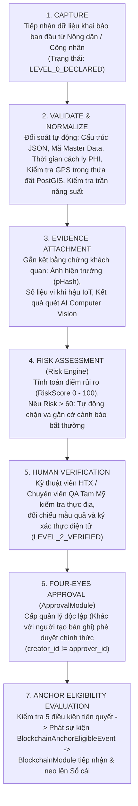
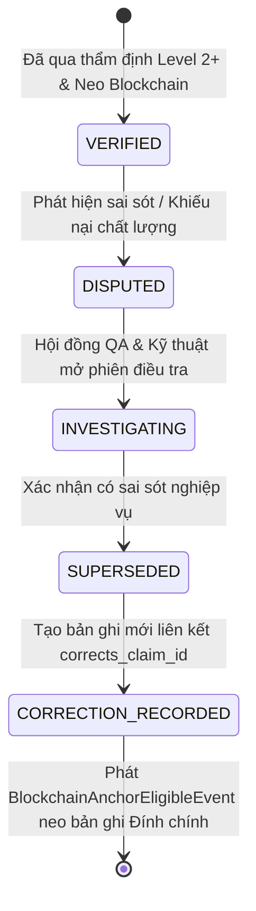

# DATA TRUST & ASSURANCE ARCHITECTURE — TAM MỸ SMART FRUIT ECOSYSTEM
## MULTI-LAYER VERIFICATION, CLAIM MODEL & ANCHORING ELIGIBILITY ENGINE

> **Tài liệu Kiến trúc Độ tin cậy Dữ liệu & Chống Gian lận (Data Trust Specification)**  
> **Phiên bản:** 2.1.0-PROD  
> **Nguyên tắc cốt lõi:** Blockchain không tạo ra sự thật vật lý — Sự tin cậy được xây dựng bằng kiểm chứng đa tầng  

---

## 1. TRIẾT LÝ XÂY DỰNG ĐỘ TIN CẬY DỮ LIỆU (DATA TRUST PHILOSOPHY)

Hệ thống Tam Mỹ Smart Fruit bác bỏ hoàn toàn tư duy *"Cứ đưa dữ liệu lên Blockchain là trở thành dữ liệu thật"*. Dữ liệu thô do người dùng tự khai (`Level 0`) nếu đưa thẳng lên Blockchain chỉ làm cho dữ liệu sai khó bị sửa chữa.

Do đó, sự tin cậy được kiến tạo qua **12 Lớp Kiểm Soát Độc Lập**:
```
1. Xác thực Danh tính (Identity) 
   ➔ 2. Phân quyền Nghiệp vụ (RBAC + Data Scope) 
   ➔ 3. Dữ liệu Chủ kiểm soát (Master Data) 
   ➔ 4. Kế thừa Thượng nguồn Bắt buộc (System Inheritance) 
   ➔ 5. Đối soát Geofence Không gian (PostGIS GPS) 
   ➔ 6. Dữ liệu Môi trường Khách quan (IoT Sensors) 
   ➔ 7. Màng lọc Thị giác Khách quan (AI Guards) 
   ➔ 8. Cân bằng Khối lượng Bất biến (Mass Balance) 
   ➔ 9. Thẩm định Thực địa Chuyên gia (Human Verification) 
   ➔ 10. Phê duyệt 4 Mắt Độc lập (4-Eyes Approval) 
   ➔ 11. Chứng nhận Phòng Lab Độc lập (Independent Lab/Cert) 
   ➔ 12. Neo Dấu Vân Tay Chuỗi Khối (BlockchainAnchorEligibleEvent)
```

---

## 2. QUY TRÌNH THẨM ĐỊNH DỮ LIỆU 7 BƯỚC (7-STEP VERIFICATION PIPELINE)



---

## 3. ĐIỀU KIỆN TIÊN QUYẾT ĐỦ ĐIỀU KIỆN NEO CHUỖI KHỐI (ANCHORING GATING CONDITIONS)

Sự kiện `BlockchainAnchorEligibleEvent` **CHỈ ĐƯỢC PHÉP PHÁT SINH** khi thỏa mãn đồng thời 100% các tiêu chuẩn sau:
1. **Chính sách Cấp độ Tin cậy Thỏa mãn (Assurance Policy Satisfied):** Bản ghi đạt mức `LEVEL_2_ORGANIZATION_VERIFIED` hoặc `LEVEL_3_INDEPENDENT_CERTIFIED` theo quy định của từng loại sự kiện.
2. **Quyết định Đánh giá Rủi ro Chấp thuận (`RiskPolicy.evaluate() == ALLOW_ANCHOR`):** Điểm rủi ro tổng hợp thỏa mãn ngưỡng chính sách đang có hiệu lực (`effective_date_aware`, `versioned`, `auditable` — ngưỡng mặc định ban đầu là $25\text{ điểm}$, nhưng có thể tùy biến theo danh mục sản phẩm).
3. **Chính sách Bằng chứng Đầy đủ (Evidence Policy Satisfied):** Đầy đủ các bằng chứng khách quan bắt buộc (Ảnh chụp hiện trường kèm pHash, Số liệu cảm biến IoT, hoặc Kết quả kiểm định AI).
4. **Xác thực Chuyên gia Hoàn tất (Verification Completed):** Đã có chữ ký số điện tử của Kỹ thuật viên nông nghiệp hoặc Chuyên viên QA có thẩm quyền.
5. **Phê duyệt 4 Mắt Độc Lập Hoàn tất (Four-Eyes Approval Completed):** Yêu cầu phê duyệt từ `ApprovalModule` được thông qua với ràng buộc bất biến $\text{creator\_id} \ne \text{approver\_id}$.
6. **Loại Sự kiện Hợp lệ (Event Type Permitted):** Sự kiện thuộc danh mục được phép neo theo cấu hình của `BlockchainAnchoringPolicy`.

---

## 4. MÔ HÌNH KHẲNG ĐỊNH DỮ LIỆU (CLAIM MODEL SCHEMA)

```sql
CREATE TABLE data_claims (
    id UUID PRIMARY KEY DEFAULT gen_random_uuid(),
    claim_type VARCHAR(80) NOT NULL, -- CROP_VARIETY, AREA_PUC, PHI_SAFE, QUALITY_GRADE, BIO_SAFETY
    subject_type VARCHAR(60) NOT NULL, -- TREE_GROUP, PLOT, HARVEST_BATCH, PACKING_BATCH, PALLET
    subject_id UUID NOT NULL,
    value_code VARCHAR(80) NOT NULL, -- VD: JACKFRUIT_THAI, GRADE_A, PASSED
    value_json JSONB,
    declared_by UUID NOT NULL,
    declared_at TIMESTAMPTZ DEFAULT CURRENT_TIMESTAMP,
    source_type VARCHAR(60) NOT NULL, -- FARMER_DECLARATION, TECHNICIAN_INSPECTION, LAB_RESULT, AI_INFERENCE, IOT_DEVICE, CERTIFICATION_BODY
    assurance_level VARCHAR(40) NOT NULL DEFAULT 'LEVEL_0_DECLARED',
    verification_status VARCHAR(40) NOT NULL DEFAULT 'PENDING', -- PENDING, VERIFIED, REJECTED, DISPUTED, REVOKED
    verified_by UUID,
    verified_at TIMESTAMPTZ,
    verification_method VARCHAR(80),
    approval_request_id UUID, -- Liên kết với ApprovalModule
    risk_score NUMERIC(5,2) DEFAULT 0.00,
    blockchain_proof_id UUID,
    is_current BOOLEAN DEFAULT TRUE,
    superseded_by_claim_id UUID
);

CREATE INDEX idx_claims_subject ON data_claims(subject_type, subject_id) WHERE is_current = TRUE;
```

---

## 5. QUY TRÌNH ĐÍNH CHÍNH & KHÔNG GHI ĐÈ LỊCH SỬ (NEVER OVERWRITE)



*Nguyên tắc bất biến:* Bản ghi ban đầu **không bao giờ bị xóa hoặc cập nhật đè**. Bảng `data_claims` áp dụng quy tắc xóa `ON DELETE RESTRICT` đối với các Claim đã được xác minh (`VERIFIED`), đảm bảo tính toàn vẹn tuyệt đối trước cơ quan thanh tra kiểm toán.
