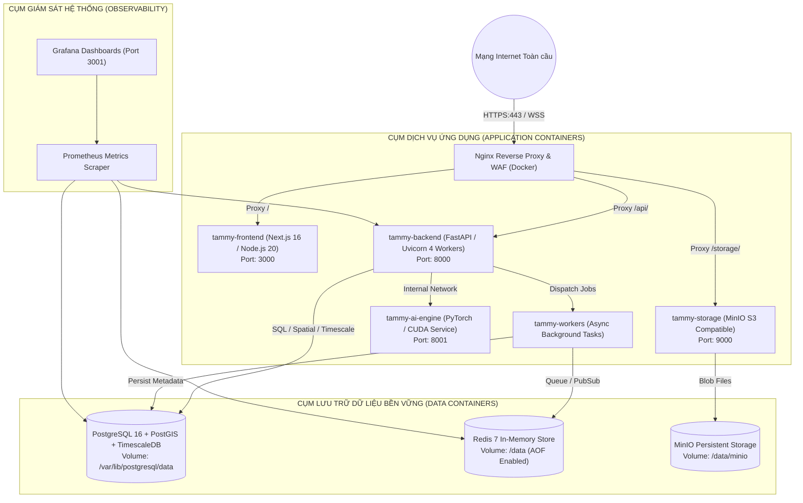

# DEPLOYMENT, BACKUP & DISASTER RECOVERY ARCHITECTURE — TAM MỸ SMART FRUIT ECOSYSTEM
## CONTAINERIZED DEPLOYMENT, BACKUP PITR & INFRASTRUCTURE TOPOLOGY

> **Tài liệu Kiến trúc Triển khai & Khôi phục Sau Thảm họa (Deployment Specification)**  
> **Phiên bản:** 2.0.0-PROD  
> **Nguyên tắc cốt lõi:** Docker Compose First — Zero Over-engineering — RPO $\le 15\text{ phút}$ | RTO $\le 1\text{ giờ}$  

---

## 1. SƠ ĐỒ HẠ TẦNG TRIỂN KHAI PRODUCTION (PRODUCTION DEPLOYMENT TOPOLOGY)

---

## 2. QUẢN LÝ BA MÔI TRƯỜNG (MULTI-ENVIRONMENT TOPOLOGY)

| Môi Trường (Environment) | Mục Đích Sử Dụng | Cấu Hình Cơ Sở Dữ Liệu | Chiến Lược Triển Khai |
| :--- | :--- | :--- | :--- |
| **Development (Dev)** | Lập trình tính năng, chạy unit tests cục bộ. | Docker PostgreSQL + MinIO nội bộ máy developer. | Chạy lệnh `docker compose -f docker-compose.dev.yml up`. |
| **Staging (UAT)** | Kiểm thử tích hợp, demo cho khách hàng & HTX. | Máy chủ Cloud riêng biệt, dữ liệu mẫu đã ẩn danh. | Tự động triển khai qua GitHub Actions khi merge vào nhánh `staging`. |
| **Production (Live)** | Vận hành chuỗi cung ứng thương mại thật. | Cụm máy chủ chuyên dụng, bật nén Timescale, sao lưu WAL. | Triển khai Rolling Update không gián đoạn dịch vụ qua nhánh `main`. |

---

## 3. CHIẾN LƯỢC SAO LƯU & KHÔI PHỤC SAU THẢM HỌA (BACKUP & DISASTER RECOVERY)

### 3.1. Các chỉ số cam kết (SLA Targets):
- **RPO (Recovery Point Objective):** $\le 15\text{ phút}$ (Mất mát dữ liệu tối đa không quá 15 phút giao dịch trong trường hợp thảm họa phần cứng nghiêm trọng).
- **RTO (Recovery Time Objective):** $\le 60\text{ phút}$ (Khôi phục toàn bộ hệ thống hoạt động trở lại trong vòng 1 giờ).

### 3.2. Cơ chế sao lưu đa tầng (Multi-tier Backup Pipeline):
1. **PostgreSQL WAL Archiving & PITR (Point-In-Time Recovery):**
   - Bật cơ chế ghi nhật ký trước khi ghi (Write-Ahead Logging - WAL) đẩy liên tục lên máy chủ lưu trữ sao lưu từ xa mỗi 5 phút.
   - Sao lưu toàn phần (Full Base Backup) tự động vào 02:00 sáng hàng ngày.
2. **MinIO / S3 Object Storage Versioning:**
   - Kích hoạt tính năng lưu phiên bản tệp tin (Bucket Versioning) để chống xóa nhầm ảnh chứng từ / bằng chứng AI.
   - Đồng bộ hóa định kỳ (Mirror Sync) sang một vùng lưu trữ độc lập (Secondary Cloud Region).
3. **Redis Append-Only File (AOF):**
   - Cấu hình `appendfsync everysec` đảm bảo không mất mát các Job đang xếp hàng khi xảy ra sự cố mất điện đột ngột.
