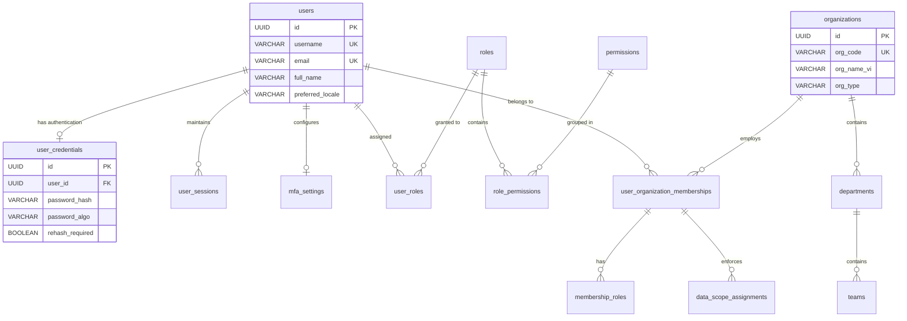
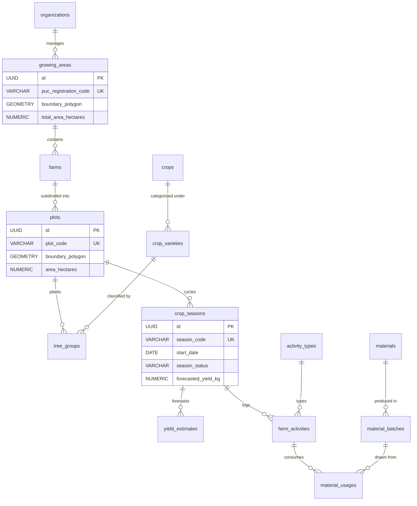
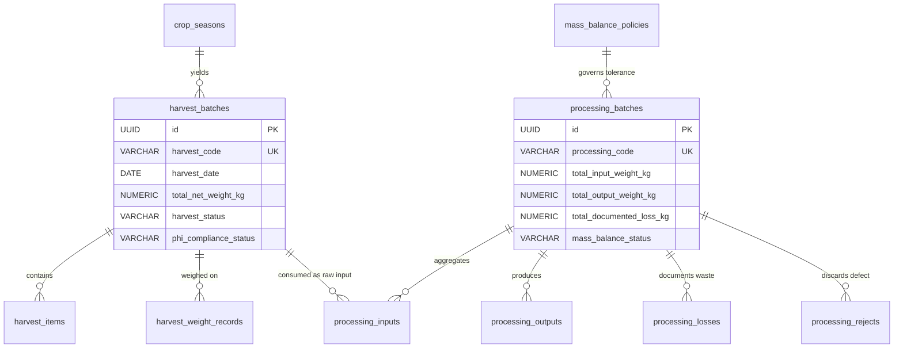
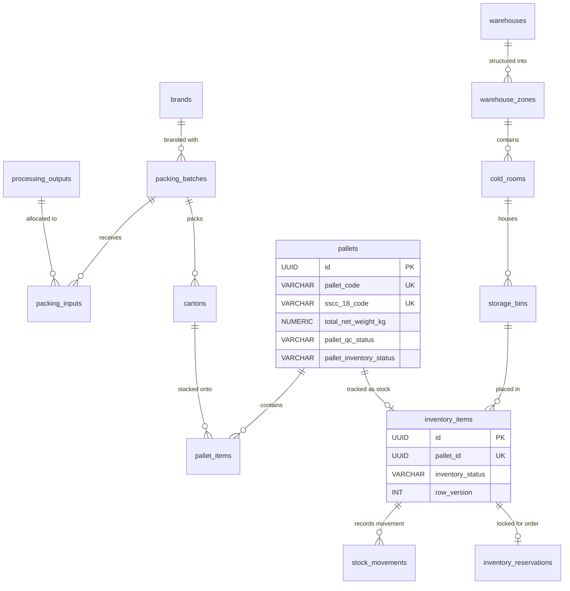
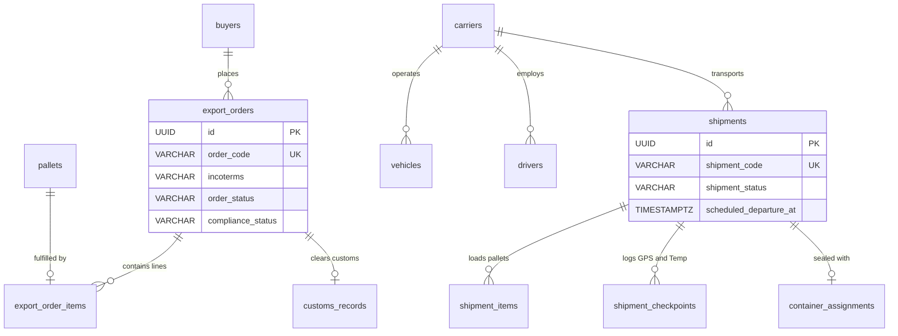
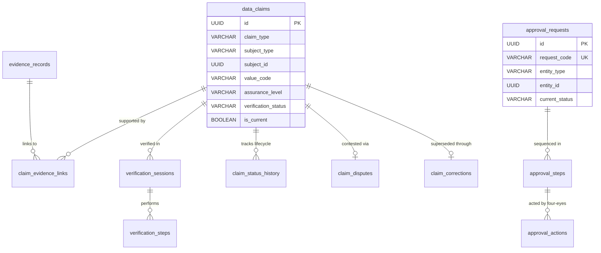
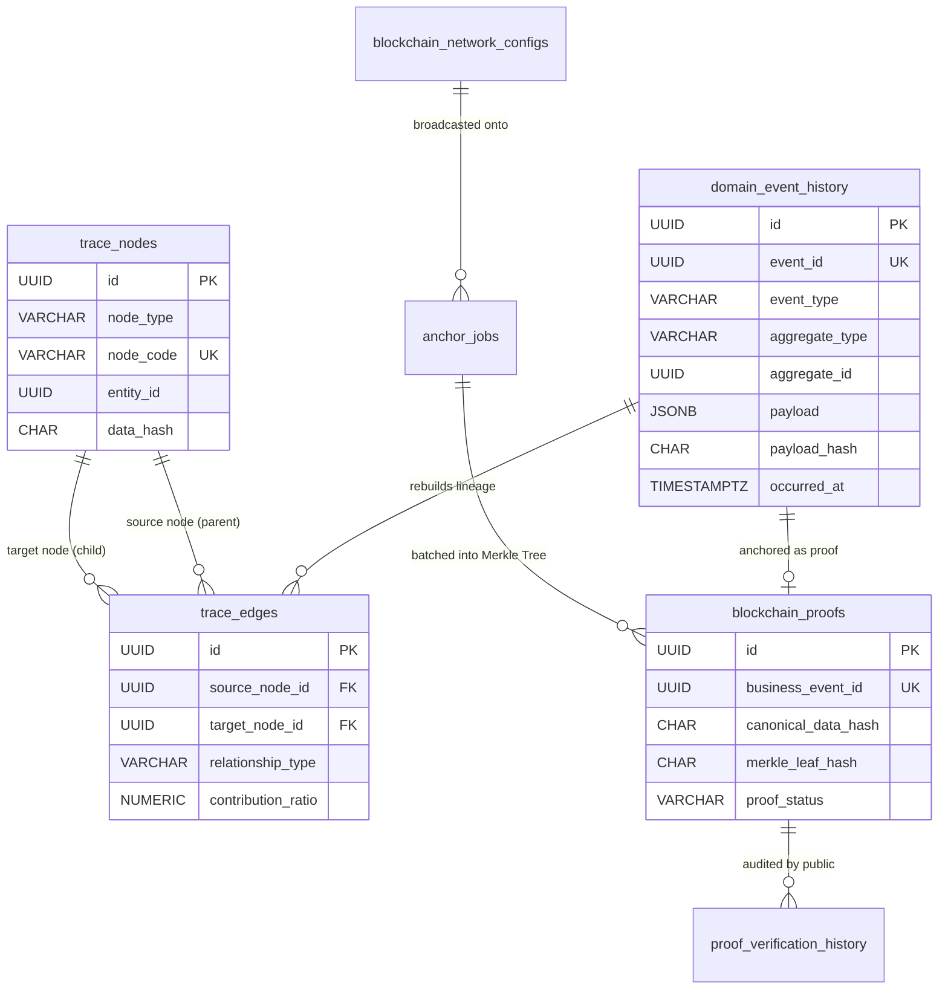

# ENTITY RELATIONSHIP DIAGRAMS (ERD) — TAM MỸ SMART FRUIT ECOSYSTEM
## DOMAIN-PARTITIONED CONCEPTUAL & LOGICAL RELATIONSHIP MODELS

> **Tài liệu Sơ đồ Quan hệ Thực thể Theo Miền Nghiệp vụ (Domain-Partitioned ERD)**  
> **Phiên bản:** 3.0.0-PROD  
> **Nguyên tắc:** Phân tách rõ ràng theo từng phân hệ — Không nhồi nhét toàn bộ bảng vào 1 sơ đồ đơn lẻ  

---

## 1. PHÂN HỆ NỀN TẢNG, DANH TÍNH & ĐA TỔ CHỨC (FOUNDATION & IDENTITY ERD)

---

## 2. PHÂN HỆ VÙNG TRỒNG, THỬA ĐẤT & CANH TÁC (FARM, AGRONOMY & GIS ERD)

---

## 3. PHÂN HỆ THU HOẠCH, SƠ CHẾ & CÂN BẰNG KHỐI LƯỢNG (HARVEST & PROCESSING ERD)

---

## 4. PHÂN HỆ ĐÓNG GÓI, KHO LẠNH & TỒN KHO (PACKING & INVENTORY ERD)

---

## 5. PHÂN HỆ VẬN TẢI, XUẤT KHẨU & HẢI QUAN (LOGISTICS & EXPORT ERD)

---

## 6. PHÂN HỆ DATA TRUST, BẰNG CHỨNG & PHÊ DUYỆT 4 MẮT (DATA TRUST & APPROVAL ERD)

---

## 7. PHÂN HỆ TRUY XUẤT NGUỒN GỐC & CHUỖI KHỐI (TRACEABILITY DAG & BLOCKCHAIN ERD)

