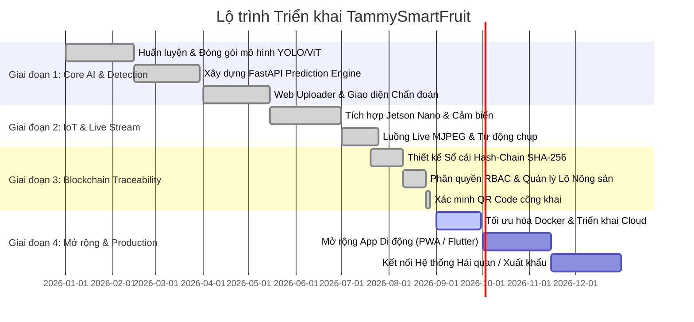

# IMPLEMENTATION PLAN & ROADMAP - TAMMYSMARTFRUIT

> ⚠️ **STATUS: LEGACY / PRE-PHASE-2 / NOT AUTHORITATIVE**  
> Tài liệu này mô tả lộ trình của giai đoạn xây dựng AI prototype ban đầu.  
> **Tài liệu đặc tả chuẩn:** Vui lòng tham chiếu [MASTER_SPEC.md](file:///d:/Project/CayMit_Web_Dashboard/tammysmartfruit/docs/MASTER_SPEC.md) và [PHASE_1_DOMAIN_ANALYSIS.md](file:///d:/Project/CayMit_Web_Dashboard/tammysmartfruit/docs/PHASE_1_DOMAIN_ANALYSIS.md). Kế hoạch phát hành toàn diện theo chuẩn Production (Release 1 đến Release 6) sẽ được chi tiết hóa trong **Phase 7 (Implementation Roadmap)**.

---

## 1. Lộ trình Triển khai Tổng thể (Project Roadmap)

---

## 2. Chi tiết các Giai đoạn Triển khai

### Giai đoạn 1: Phân hệ AI & Chẩn đoán Bệnh Cây Mít (Hoàn thành)
- [x] Huấn luyện mô hình YOLOv11 nhận diện 4 bệnh thân cành mít.
- [x] Huấn luyện mô hình YOLOv26m / EfficientNet nhận diện bệnh trên quả mít.
- [x] Tích hợp ViT-100 Classifier và General Object Guard để loại bỏ ảnh dương tính giả ngoài miền.
- [x] Xây dựng giao diện Web Next.js hỗ trợ tải ảnh và trả kết quả tức thì.

### Giai đoạn 2: Giám sát Vi khí hậu & Luồng Camera IoT (Hoàn thành)
- [x] Kết nối vi điều khiển Jetson Nano / ESP32 thu thập số liệu nhiệt độ, độ ẩm.
- [x] Phát triển luồng video trực tiếp MJPEG qua WebSocket/HTTP Stream.
- [x] Xây dựng tính năng Auto-capture chụp ảnh tự động và cảnh báo dịch bệnh theo thời gian thực.
- [x] Thống kê biểu đồ dịch bệnh và vi khí hậu theo chu kỳ tuần/tháng.

### Giai đoạn 3: Hệ thống Truy xuất Nguồn gốc Chuỗi khối (Hoàn thành)
- [x] Thiết kế cấu trúc khối sự kiện liên kết mã băm SHA-256 chống gian lận.
- [x] Phân quyền người dùng theo 4 vai trò: Admin, Nông hộ (Producer), Sơ chế đóng gói (Processor), Logistics xuất khẩu.
- [x] Tạo mã lô tự động (VD: `TM-260828-A1B2C3`) kèm tem QR Code công khai.
- [x] Tích hợp kết quả kiểm định AI trực tiếp vào chuỗi giá trị của lô nông sản.
- [x] Trang tra cứu hành trình minh bạch cho người tiêu dùng và đối tác thu mua.

### Giai đoạn 4: Đóng gói Triển khai & Mở rộng (Đang tiến hành)
- [ ] Container hóa toàn bộ hệ thống bằng Docker & Docker Compose đa môi trường (GPU/CPU).
- [ ] Thiết lập CI/CD tự động hóa kiểm thử và triển khai lên máy chủ Cloud / Kubernetes.
- [ ] Phát triển ứng dụng di động PWA / Mobile App cho công nhân quét QR và cập nhật nhật ký ngoài đồng ruộng khi offline.
- [ ] Tích hợp API chuẩn quốc tế (GS1 Digital Link) phục vụ xuất khẩu sang thị trường Châu Âu, Mỹ và Trung Quốc.

---

## 3. Tiêu chí Nghiệm thu Hệ thống (Acceptance Criteria)

1. **Độ chính xác AI (AI Precision/Recall):** Độ chính xác nhận diện các bệnh phổ biến trên cây và quả đạt trên 92% trong điều kiện ánh sáng tự nhiên.
2. **Khả năng chống gian lận (Tamper Resistance):** Bất kỳ can thiệp trực tiếp vào database để chỉnh sửa nội dung sự kiện cũ sẽ bị cơ chế kiểm tra SHA-256 phát hiện và đổi trạng thái sang `Không toàn vẹn`.
3. **Độ sẵn sàng (High Availability):** API phản hồi dưới 200ms cho các truy vấn dữ liệu thông thường; nạp trang Dashboard dưới 1.5 giây.
