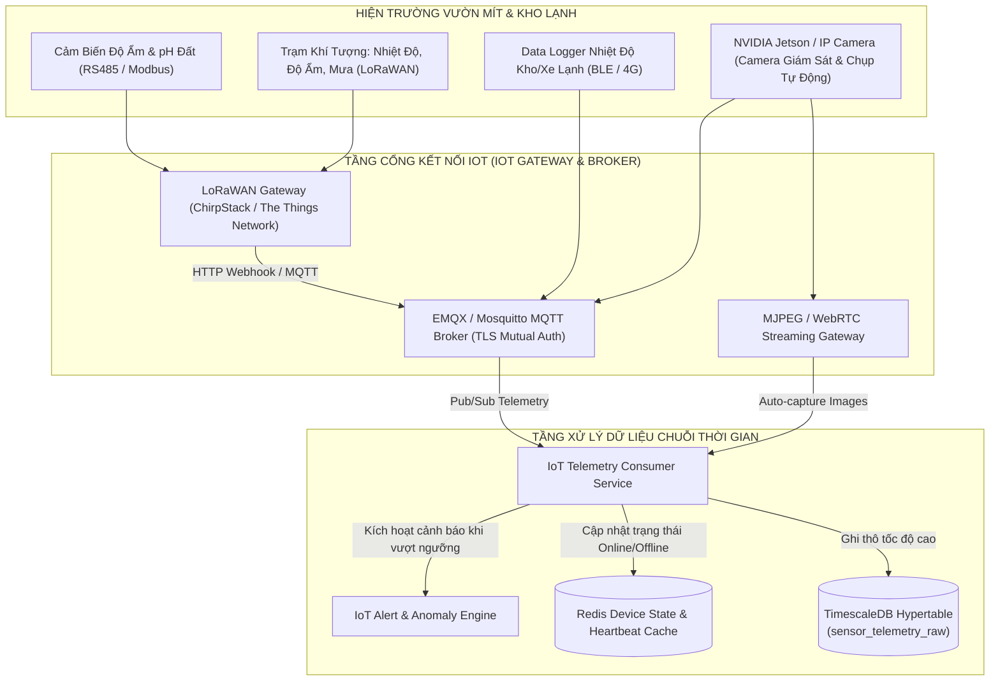

# IOT & EDGE TELEMETRY ARCHITECTURE — TAM MỸ SMART FRUIT ECOSYSTEM
## SENSOR INGESTION, TIMESCALEDB HYPERTABLES & EDGE CAMERA STREAMING

> **Tài liệu Kiến trúc IoT & Cảm biến Môi trường (IoT Specification)**  
> **Phiên bản:** 2.0.0-PROD  
> **Nguyên tắc cốt lõi:** Phân lập luồng dữ liệu thô — Không làm nghẽn CSDL quan hệ — Giám sát liên tục chuỗi lạnh  

---

## 1. MÔ HÌNH THU THẬP DỮ LIỆU IOT ĐA GIAO THỨC (IOT PROTOCOL ARCHITECTURE)



---

## 2. CẤU TRÚC BẢNG TIMESCALEDB CHUYÊN BIỆT (TIMESCALEDB HYPERTABLE SCHEMA)

Dữ liệu thô từ hàng nghìn cảm biến được ghi trực tiếp vào Hypertable phân vùng theo thời gian:

```sql
-- 1. Bảng lưu trữ số liệu cảm biến thô (Hypertable)
CREATE TABLE sensor_telemetry_raw (
    time TIMESTAMPTZ NOT NULL,
    device_id UUID NOT NULL,
    plot_id UUID,
    warehouse_id UUID,
    metric_type VARCHAR(40) NOT NULL, -- temp_c, humidity_pct, soil_moisture_pct, soil_ph, ec_ms_cm, lux, co2_ppm
    metric_value NUMERIC(8,3) NOT NULL,
    battery_pct NUMERIC(4,1),
    signal_rssi INT
);

-- Biến bảng thành TimescaleDB Hypertable phân vùng 7 ngày
SELECT create_hypertable('sensor_telemetry_raw', 'time', chunk_time_interval => INTERVAL '7 days');

-- Tạo Index tối ưu truy vấn theo thiết bị và thời gian
CREATE INDEX idx_telemetry_device_time ON sensor_telemetry_raw (device_id, time DESC);

-- 2. Chính sách Nén dữ liệu tự động sau 14 ngày (Tiết kiệm 90% dung lượng đĩa)
ALTER TABLE sensor_telemetry_raw SET (
    timescaledb.compress,
    timescaledb.compress_segmentby = 'device_id, metric_type',
    timescaledb.compress_orderby = 'time DESC'
);
SELECT add_compression_policy('sensor_telemetry_raw', INTERVAL '14 days');

-- 3. Bảng Tổng hợp liên tục 1 giờ (Continuous Aggregate) phục vụ vẽ đồ thị Dashboard
CREATE MATERIALIZED VIEW sensor_telemetry_hourly
WITH (timescaledb.continuous) AS
SELECT 
    time_bucket('1 hour', time) AS bucket,
    device_id,
    metric_type,
    AVG(metric_value) AS avg_value,
    MIN(metric_value) AS min_value,
    MAX(metric_value) AS max_value,
    COUNT(*) AS reading_count
FROM sensor_telemetry_raw
GROUP BY bucket, device_id, metric_type;
```

---

## 3. GIÁM SÁT THỜI GIAN THỰC & ĐIỀU KHIỂN THIẾT BỊ (DEVICE CONTROL & ALERT ENGINE)

1. **Phát hiện Mất kết nối (Device Heartbeat Timeout):**
   - Thiết bị gửi tín hiệu duy trì sự sống (Heartbeat) mỗi $60\text{ giây}$ lên Redis: `SET device:heartbeat:{device_id} timestamp EX 180`.
   - Nếu sau $3\text{ phút}$ không có tín hiệu, hệ thống phát sự kiện `DeviceOfflineAlertEvent`.
2. **Cảnh báo Vượt ngưỡng Chuỗi lạnh (Cold Chain Anomaly):**
   - Nhiệt độ kho lạnh vượt dải $[10^\circ\text{C}, 13^\circ\text{C}]$ kéo dài $> 30\text{ phút}$ ➔ Kích hoạt cảnh báo khẩn cấp (Push / Email / SMS) cho Thủ kho và Đội QA.
3. **Điều khiển Thiết bị Phần cứng (Actuator Command Channel):**
   - Quản trị viên gửi lệnh bật đèn trợ sáng vườn qua giao thức MQTT topic `devices/{device_id}/command` kèm token xác thực phiên để chống bị tấn công giả mạo lệnh điều khiển.
