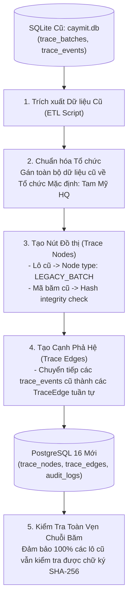

# LEGACY MIGRATION & CODE REUSE STRATEGY — TAM MỸ SMART FRUIT ECOSYSTEM
## 5R REUSE ASSESSMENT, CODE TRANSFORMATION & DATA MIGRATION PLAN

> **Tài liệu Chiến lược Kế thừa & Chuyển đổi Mã nguồn Cũ (Legacy Migration Specification)**  
> **Phiên bản:** 2.0.0-PROD  
> **Nguyên tắc cốt lõi:** Tối đa hóa tái sử dụng các thành phần AI/IoT sẵn có — Chuyển đổi sạch sẽ sang Kiến trúc Module mới  

---

## 1. BẢNG PHÂN LOẠI ĐÁNH GIÁ 5R (5R ASSESSMENT MATRIX)

Dựa trên việc kiểm toán toàn bộ mã nguồn hiện có trong thư mục `backend/` và `src/`, các thành phần được phân loại theo mô hình 5R:

| Thành Phần Mã Nguồn Cũ | Đường Dẫn File Hiện Có | Phân Loại 5R | Kế Hoạch Tái Sử Dụng / Chuyển Đổi Chi Tiết |
| :--- | :--- | :---: | :--- |
| **Các Trọng Số Mô Hình AI** | `backend/best_11.pt`, `best.pt`, `best_jackfruit_model.pth`, `models/fruit_100_vit` | **REUSE** | Tái sử dụng 100% các tệp trọng số đã huấn luyện (YOLOv11, ViT-100, EfficientNet) nạp vào phân hệ AI mới. |
| **Dịch Vụ Nạp Mô Hình AI** | `backend/model_service.py` | **ADAPT** | Tái cấu trúc thành `AIService` độc lập, bổ sung cơ chế kiểm soát tiến trình và xuất bằng chứng suy luận kèm mã băm ảnh. |
| **Luồng Video & Camera Edge** | `backend/routers/stream.py` | **REUSE** | Kế thừa logic truyền luồng MJPEG thời gian thực và cơ chế tự động chụp ảnh snapshot định kỳ. |
| **Giao Thức Điều Khiển Thiết Bị** | `backend/routers/devices.py` | **ADAPT** | Nâng cấp giao thức từ HTTP Polling đơn giản sang hỗ trợ thêm MQTT Broker có xác thực token thiết bị. |
| **Cơ Sở Dữ Liệu SQLite Cũ** | `backend/caymit.db` | **MIGRATE** | Viết script chuyển đổi dữ liệu (ETL Migration) từ bảng `trace_batches` cũ sang cấu trúc DAG `trace_nodes` trên PostgreSQL. |
| **Phân Quyền & Xác Thực Cũ** | `backend/routers/traceability.py` (Auth cũ) | **REWRITE** | Viết lại hoàn toàn theo kiến trúc RBAC đa tổ chức (`Multi-Tenancy`) kết hợp phạm vi dữ liệu (`Data Scope`). |
| **Mô Hình Lô Hàng Đơn Cũ** | `trace_batches` (chỉ có trường `current_stage`) | **REWRITE** | Chuyển đổi sang mô hình 4 Aggregate Roots riêng biệt (`HarvestBatch`, `ProcessingBatch`, `PackingBatch`, `Pallet`). |
| **Giao Diện Web & Biểu Đồ** | `src/app/`, `src/components/`, Tailwind tokens | **ADAPT** | Kế thừa hệ thống biểu đồ Recharts, Lucide Icons; nâng cấp màu chủ đạo sang `#2F8F3A`, font `Be Vietnam Pro` và gắn hàm dịch i18n `{t()}`. |

---

## 2. QUY TRÌNH CHUYỂN ĐỔI DỮ LIỆU CŨ SANG KIẾN TRÚC DAG (DATA MIGRATION PIPELINE)

Khi hệ thống mới trên PostgreSQL được khởi tạo:

---

## 3. NGUYÊN TẮC AN TOÀN TRONG QUÁ TRÌNH CHUYỂN ĐỔI (ZERO REGRESSION RULES)

1. **Không can thiệp vào máy chủ đang chạy:** Việc phát triển kiến trúc mới trong Phase 3 và Phase 4 hoàn toàn độc lập, không làm dừng máy chủ demo hiện tại (`http://localhost:3000` và `http://localhost:8000`).
2. **Kế thừa 100% khả năng suy luận AI:** Không phải huấn luyện lại các mô hình AI từ đầu; bảo toàn toàn bộ công sức gán nhãn và tối ưu hóa trước đó.
