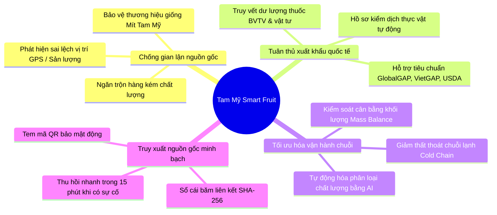
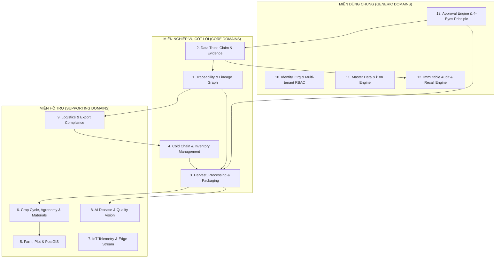
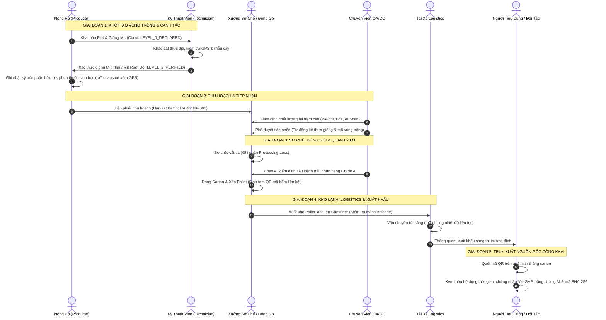
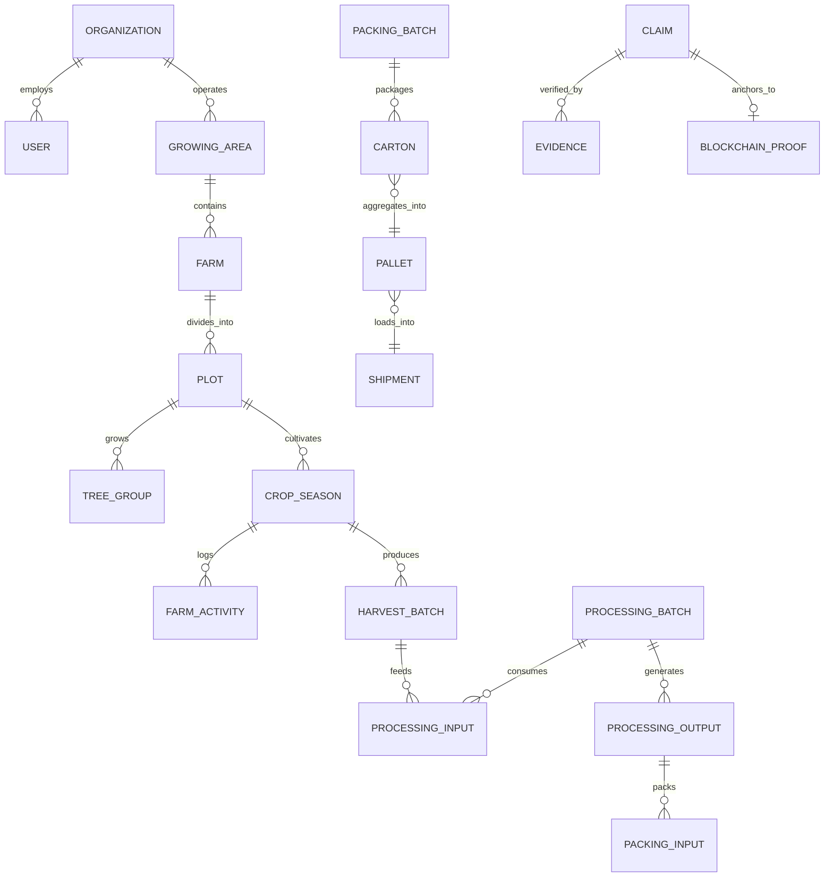
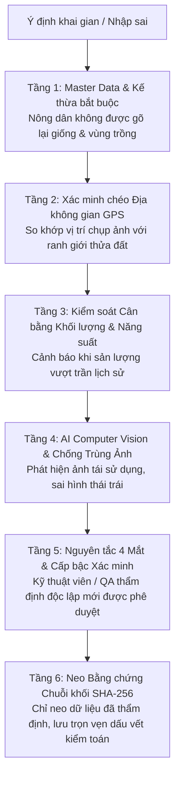
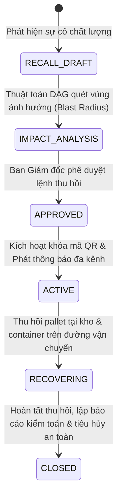
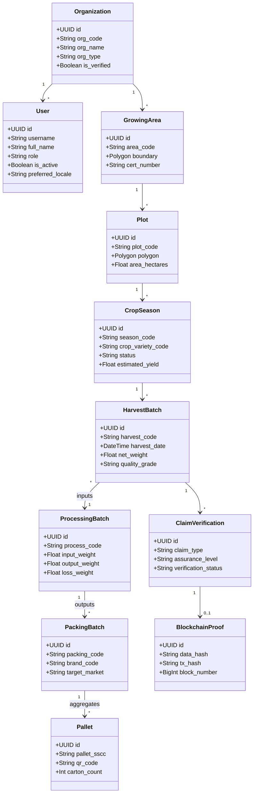

# TAM MỸ SMART FRUIT ECOSYSTEM — PHASE 1: COMPREHENSIVE DOMAIN ANALYSIS & SYSTEM BLUEPRINT

> **Tài liệu đặc tả phân tích nghiệp vụ & kiến trúc miền (Domain-Driven Design Specification)**  
> **Phiên bản:** 1.0.0-PROD  
> **Ngôn ngữ chuẩn:** Song ngữ Tiếng Việt & English (VI / EN)  
> **Tình trạng:** Chờ phê duyệt (Awaiting Business Review) — **CHƯA VIẾT SOURCE CODE**

---

## MỤC LỤC
1. [Executive System Overview & Bối cảnh hệ thống](#1-executive-system-overview--bối-cảnh-hệ-thống)
2. [Mục tiêu kinh doanh & Giá trị cốt lõi (Business Goals)](#2-mục-tiêu-kinh-doanh--giá-trị-cốt-lõi)
3. [Phân tích Stakeholder & Ma trận Actor](#3-phân-tích-stakeholder--ma-trận-actor)
4. [Bản đồ miền nghiệp vụ (Complete Business Domain Map)](#4-bản-đồ-miền-nghiệp-vụ)
5. [Các Bounded Contexts & Context Mapping](#5-các-bounded-contexts--context-mapping)
6. [Chuỗi giá trị đầu-cuối (End-to-End Value Chain)](#6-chuỗi-giá-trị-đầu-cuối)
7. [Mô hình Domain Model & Aggregate Roots](#7-mô-hình-domain-model--aggregate-roots)
8. [Danh mục Thực thể & Mối quan hệ (Entity Relationships)](#8-danh-mục-thực-thể--mối-quan-hệ)
9. [Mô hình Dữ liệu Chủ (Master Data Model & i18n)](#9-mô-hình-dữ-liệu-chủ)
10. [Mô hình Tổ chức & Đa cấp (Organization & Multi-Tenancy)](#10-mô-hình-tổ-chức--đa-cấp)
11. [Mô hình Nông dân & Quản lý Đất đai / GIS](#11-mô-hình-nông-dân--quản-lý-đất-đai--gis)
12. [Mô hình Mùa vụ & Chu kỳ canh tác (Season / Crop Cycle)](#12-mô-hình-mùa-vụ--chu-kỳ-canh-tác)
13. [Mô hình Nhật ký Canh tác & Quản lý Vật tư nông nghiệp](#13-mô-hình-nhật-ký-canh-tác--quản-lý-vật-tư)
14. [Mô hình IoT & Chuỗi thời gian (Time-series Telemetry)](#14-mô-hình-iot--chuỗi-thời-gian)
15. [Mô hình AI Hỗ trợ Ra Quyết định & Bằng chứng Giám định](#15-mô-hình-ai-hỗ-trợ-ra-quyết-định)
16. [Mô hình Thu hoạch & Thu hoạch Từng phần (Harvesting)](#16-mô-hình-thu-hoạch--thu-hoạch-từng-phần)
17. [Mô hình Tiếp nhận & Kiểm soát Chất lượng (Receiving & QC)](#17-mô-hình-tiếp-nhận--kiểm-soát-chất-lượng)
18. [Mô hình Sơ chế & Phân dòng (Processing & Transformation)](#18-mô-hình-sơ-chế--phân-dòng)
19. [Mô hình Đóng gói & Cấu trúc Phân cấp (Packing Hierarchy)](#19-mô-hình-đóng-gói--cấu-trúc-phân-cấp)
20. [Mô hình Kho lạnh, Vị trí Lưu trữ & Quản lý Tồn kho](#20-mô-hình-kho-lạnh--vị-trí-lưu-trữ--tồn-kho)
21. [Mô hình Logistics, Kiểm soát Chuỗi lạnh & Container](#21-mô-hình-logistics--chuỗi-lạnh--container)
22. [Mô hình Xuất khẩu, Thị trường & Hồ sơ Hải quan](#22-mô-hình-xuất-khẩu--thị-trường--hải-quan)
23. [Mô hình Quản lý Chứng nhận (Certificate Management)](#23-mô-hình-quản-lý-chứng-nhận)
24. [Phân tích & Giải pháp Chống Khai Gian / Gian Lận Dữ liệu](#24-phân-tích--giải-pháp-chống-khai-gian)
25. [Kiến trúc Data Trust & Mô hình Claim / Assurance Levels](#25-kiến-trúc-data-trust--mô-hình-claim)
26. [Mô hình Bằng chứng Đa nguồn & Quản lý Rủi ro (Risk Engine)](#26-mô-hình-bằng-chứng-đa-nguồn--risk-engine)
27. [Mô hình Đồ thị Truy xuất (Traceability DAG Model)](#27-mô-hình-đồ-thị-truy-xuất)
28. [Mô hình Quản lý Thu hồi Nông sản (Recall Management)](#28-mô-hình-quản-lý-thu-hồi-nông-sản)
29. [Mô hình Neo Chuỗi khối & Toàn vẹn Dữ liệu (Blockchain Anchoring)](#29-mô-hình-neo-chuỗi-khối)
30. [Mô hình Nhật ký Kiểm toán Bất biến (Audit Log)](#30-mô-hình-nhật-ký-kiểm-toán-bất-biến)
31. [Mô hình Thông báo & Cảnh báo Sự kiện (Notification Center)](#31-mô-hình-thông-báo--cảnh-báo)
32. [Mô hình Quy trình Phê duyệt & Nguyên tắc 4 Mắt (4-Eyes Approval)](#32-mô-hình-quy-trình-phê-duyệt)
33. [Máy trạng thái toàn diện (Comprehensive State Machines)](#33-máy-trạng-thái-toàn-diện)
34. [Ma trận Vai trò (User Roles) & Persona](#34-ma-trận-vai-trò--persona)
35. [Ma trận Quyền hạn (Permission Matrix: Action + Scope)](#35-ma-trận-quyền-hạn)
36. [Quy tắc Nghiệp vụ Cốt lõi (Core Business Rules)](#36-quy-tắc-nghiệp-vụ-cốt-lõi)
37. [Quy tắc Cân bằng Khối lượng (Mass Balance Rules)](#37-quy-tắc-cân-bằng-khối-lượng)
38. [Quy tắc Bảo vệ Thương hiệu & Tiêu chuẩn Thị trường](#38-quy-tắc-bảo-vệ-thương-hiệu--thị-trường)
39. [Quy tắc Đính chính Dữ liệu sau Xác minh (Correction Rules)](#39-quy-tắc-đính-chính-dữ-liệu)
40. [Kiến trúc Song ngữ VI/EN Toàn diện (i18n Architecture)](#40-kiến-trúc-song-ngữ-vien-toàn-diện)
41. [Sơ đồ Thực thể Quan hệ Khái niệm (Conceptual ERD)](#41-sơ-đồ-thực-thể-quan-hệ-khái-niệm)
42. [Kiến trúc Thông tin & Screen Map UI/UX](#42-kiến-trúc-thông-tin--screen-map)
43. [Kiểm tra Tính nhất quán (Consistency Check)](#43-kiểm-tra-tính-nhất-quán)
44. [Giả định (Assumptions), Rủi ro (Risks) & Câu hỏi cho Chủ dự án](#44-giả-định-rủi-ro--câu-hỏi-cho-chủ-dự-án)

---

## 1. Executive System Overview & Bối cảnh hệ thống

**Tam Mỹ Smart Fruit Ecosystem** là nền tảng quản trị vận hành số (Digital Operation Platform) và chuỗi cung ứng nông sản khép kín phục vụ thị trường nội địa chất lượng cao và xuất khẩu toàn cầu (Hoa Kỳ, EU, Nhật Bản, Hàn Quốc, Trung Quốc, Trung Đông).

### Định vị cốt lõi:
1. **Không phải là trang web marketing hay CRUD đơn giản**: Đây là hệ thống điều hành nghiệp vụ (ERP/SCM chuyên sâu ngành trái cây) gắn liền với tính pháp lý, chất lượng thực phẩm và quy chuẩn kiểm dịch thực vật quốc tế.
2. **Công nghệ là công cụ phụ trợ**: IoT, AI Computer Vision, Drone, PostGIS và Blockchain đóng vai trò thu thập dữ liệu khách quan, phân tích rủi ro và bảo vệ tính bất biến của dữ liệu, không thay thế quy trình kiểm soát chất lượng của con người.
3. **Nguyên tắc "Farm to Market"**: Quản lý liền mạch từ quyền sở hữu đất, nông dân, cây giống, nhật ký canh tác, thu hoạch, sơ chế, đóng gói, lưu kho lạnh, hải quan đến siêu thị/người tiêu dùng.

---

## 2. Mục tiêu kinh doanh & Giá trị cốt lõi



---

## 3. Phân tích Stakeholder & Ma trận Actor

| Actor (Mã định danh) | Vai trò thực tế | Mục tiêu tương tác | Điểm chạm giao diện (Touchpoints) |
| :--- | :--- | :--- | :--- |
| **Tam Mỹ Executive (`admin_hq`)** | Ban Giám đốc Tam Mỹ | Giám sát toàn chuỗi, bảo vệ thương hiệu, phê duyệt đối tác, báo cáo doanh thu & chất lượng | Web Executive Dashboard, Analytics |
| **Kỹ thuật viên Nông nghiệp (`technician`)** | Cán bộ kỹ thuật HTX / Tam Mỹ | Thẩm định giống, kiểm tra vùng trồng, duyệt chứng nhận, giám định dịch bệnh ngoài vườn | Mobile Field App, Soil/Pest Inspector |
| **Nông hộ / Chủ trang trại (`farmer`)** | Xã viên HTX, Chủ vườn mít | Ghi nhật ký canh tác, chụp ảnh sâu bệnh nhờ AI tư vấn, lập kế hoạch thu hoạch | Mobile App đơn giản hóa, Voice Input |
| **Trưởng Trạm Sơ chế & Đóng gói (`packhouse_lead`)** | Quản lý nhà máy đóng gói | Tiếp nhận lô mít, phân loại Grade A/B/C, cân khối lượng, in tem QR Carton/Pallet | Web Packing Hub, Barcode Scanner |
| **Kiểm soát Chất lượng (`qa_qc`)** | Chuyên viên QA/QC | Kiểm tra độ chín, dư lượng, kiểm định AI chất lượng quả, duyệt/từ chối xuất xưởng | Tablet QC App, AI Inspection Screen |
| **Thủ kho Kho lạnh (`warehouse_keeper`)** | Quản lý kho bảo quản | Nhập/xuất pallet, theo dõi biểu đồ nhiệt độ phòng lạnh, kiểm soát FIFO | Web Warehouse WMS, Handheld Scanner |
| **Tài xế / Đơn vị Vận tải (`logistics_driver`)** | Tài xế xe lạnh / Đơn vị Logistics | Cập nhật điểm kiểm soát Checkpoint, ký giao nhận điện tử, cảnh báo nhiệt độ container | Driver Mobile App, GPS Tracker |
| **Chuyên viên Xuất khẩu (`export_officer`)** | Nhân viên chứng từ xuất nhập khẩu | Soạn Commercial Invoice, Packing List, xin cấp C/O, Phytosanitary, tờ khai hải quan | Web Export Management Portal |
| **Chuyên gia Chứng nhận / Thanh tra (`auditor_inspector`)** | Đơn vị chứng nhận bên thứ 3 (SGS, Eurofins, Cục BVTV) | Tải lên kết quả kiểm nghiệm mẫu đất/nước/trái, xác thực chứng chỉ VietGAP/GlobalGAP | Auditor Portal (Read & Certify) |
| **Đối tác Thu mua / B2B (`buyer_partner`)** | Khách hàng siêu thị, nhà nhập khẩu nước ngoài | Xác minh hồ sơ lô hàng, hợp đồng xuất khẩu, nhận thông báo giao nhận | Buyer Portal, Trace Dashboard |
| **Tiến trình Hệ thống Nền (`system_worker`)** | Background Job Worker / Daemon | Tự động đối soát GPS, tổng hợp Time-series IoT, kích hoạt neo Blockchain định kỳ | Background Service (No UI) |
| **Người tiêu dùng đại chúng (`public`)** | Khách hàng mua lẻ tại siêu thị | Quét mã QR trên tem để xem xuất xứ, nhật ký và chứng chỉ an toàn | Web Public Trace Page (Không cần login) |

---

## 4. Bản đồ miền nghiệp vụ (Complete Business Domain Map)



---

## 5. Các Bounded Contexts & Context Mapping

```
+---------------------------------------------------------------------------------------------------+
| BOUNDED CONTEXT: FARM & AGRONOMY (Upstream)                                                       |
| Models: GrowingArea, Farm, Plot, TreeGroup, CropSeason, FarmActivity, InputMaterialUsage         |
+---------------------------------------------------------------------------------------------------+
                                                  │ (Shared Kernel: PlotID, VarietyCode)
                                                  ▼
+---------------------------------------------------------------------------------------------------+
| BOUNDED CONTEXT: HARVEST & VALUE-ADD (Midstream)                                                  |
| Models: HarvestBatch, ReceivingReport, ProcessingBatch, PackingBatch, Carton, Pallet              |
+---------------------------------------------------------------------------------------------------+
                                                  │ (Customer/Supplier: PalletID, MassBalance)
                                                  ▼
+---------------------------------------------------------------------------------------------------+
| BOUNDED CONTEXT: COLD CHAIN & LOGISTICS (Downstream)                                              |
| Models: WarehouseLocation, StockMovement, ColdChainLog, Shipment, Container, ExportDocument        |
+---------------------------------------------------------------------------------------------------+
                                                  │
                                                  ▼
+---------------------------------------------------------------------------------------------------+
| BOUNDED CONTEXT: TRUST & TRACEABILITY (Cross-Cutting Assurance Layer)                             |
| Models: Claim, Evidence, RiskSignal, TraceDAG, BlockchainAnchorProof, AuditLog                    |
+---------------------------------------------------------------------------------------------------+
```

---

## 6. Chuỗi giá trị đầu-cuối (End-to-End Value Chain)



---

## 7. Mô hình Domain Model & Aggregate Roots

### Bảng phân định Aggregate Roots và Transaction Boundaries:

| Aggregate Root | Các Entities / Value Objects bên trong | Ranh giới giao dịch (Transaction Boundary) |
| :--- | :--- | :--- |
| **`Organization`** | Department, Team, OrgRelationship | Đảm bảo tính cô lập dữ liệu (Multi-tenancy isolation) |
| **`GrowingArea`** | Plot, BoundaryGeometry, SoilData | Ràng buộc không gian địa lý PostGIS và mã số vùng trồng |
| **`CropSeason`** | FarmActivity, MaterialUsage, YieldForecast | Toàn bộ chu kỳ sinh trưởng của một vụ mùa trên 1 plot |
| **`HarvestBatch`** | HarvestItem, HarvestInspection, GPSProof | Khối lượng thu hoạch không vượt quá năng suất ước tính |
| **`ProcessingBatch`** | ProcessingInput, ProcessingOutput, WasteLoss | Cân bằng khối lượng nghiêm ngặt (Mass Balance Invariant) |
| **`PackingBatch`** | ProductPackage, Carton, Pallet, PalletItem | Đảm bảo 1 Carton/Pallet chỉ thuộc 1 lô đóng gói duy nhất |
| **`WarehouseInventory`**| StorageLocation, StockMovement, HoldQuarantine | Chống xuất kho trùng, cấm tồn kho âm (Negative stock lock) |
| **`Shipment`** | ShipmentItem, Checkpoint, ColdChainExcursion | Cập nhật vị trí, trạng thái seal container và nhiệt độ |
| **`ClaimVerification`**| Claim, Evidence, VerificationStep, RiskAssessment| Nâng cấp mức Assurance và chuẩn bị payload neo blockchain |
| **`TraceDAG`** | TraceNode, TraceEdge, HashBlock | Toàn vẹn chuỗi liên kết băm SHA-256 xuôi và ngược |

---

## 8. Danh mục Thực thể & Mối quan hệ (Entity Relationships)



---

## 9. Mô hình Dữ liệu Chủ (Master Data Model & i18n)

### Nguyên tắc thiết kế:
1. **Không hard-code giá trị nghiệp vụ**: Tên giống cây, loại bệnh, đơn vị đo lường, công đoạn, chứng nhận đều là Master Data có phiên bản.
2. **Code-first Identifier**: Sử dụng mã chuẩn hóa (VD: `JACKFRUIT_THAI`, `KG`, `STAGE_HARVEST`), không dùng chuỗi văn bản làm khóa ngoại.
3. **Bảng dịch ngữ tách biệt (Translation Tables)**:

```sql
-- Bảng Master: Giống cây
CREATE TABLE crop_varieties (
    id UUID PRIMARY KEY DEFAULT gen_random_uuid(),
    variety_code VARCHAR(60) UNIQUE NOT NULL,
    crop_code VARCHAR(60) NOT NULL,
    scientific_name VARCHAR(120),
    standard_maturity_days INT,
    average_fruit_weight_kg NUMERIC(6,2),
    is_active BOOLEAN DEFAULT TRUE,
    created_at TIMESTAMPTZ DEFAULT CURRENT_TIMESTAMP
);

-- Bảng dịch thuật đa ngôn ngữ
CREATE TABLE crop_variety_translations (
    variety_id UUID REFERENCES crop_varieties(id) ON DELETE CASCADE,
    locale VARCHAR(10) NOT NULL, -- 'vi' hoặc 'en'
    name VARCHAR(150) NOT NULL,
    description TEXT,
    PRIMARY KEY (variety_id, locale)
);
```

---

## 10. Mô hình Tổ chức & Đa cấp (Organization & Multi-Tenancy)

### Phân loại tổ chức:
- `HEADQUARTERS`: Tổng công ty Tam Mỹ (Quản trị tối cao).
- `COOPERATIVE`: Hợp tác xã nông nghiệp (Quản lý nhiều nông hộ).
- `ENTERPRISE_FARM`: Nông trường / Doanh nghiệp canh tác độc lập.
- `PACKING_FACILITY`: Nhà máy sơ chế & đóng gói xuất khẩu.
- `COLD_STORAGE_FACILITY`: Trung tâm kho vận lạnh.
- `LOGISTICS_PROVIDER`: Đơn vị vận chuyển đường bộ/biển.
- `CERTIFICATION_BODY`: Tổ chức đánh giá & cấp chứng chỉ độc lập.
- `BUYER_PARTNER`: Hệ thống phân phối / Nhà nhập khẩu.

Mỗi truy vấn dữ liệu vận hành bắt buộc lọc theo `organization_id` hoặc phạm vi phân quyền liên kết (`Data Scope`).

---

## 11. Mô hình Nông dân & Quản lý Đất đai / GIS

### Cấu trúc dữ liệu địa không gian (PostGIS Spatial Model):
- **GrowingArea (Vùng trồng):** Lưu trữ vùng đa giác lớn (Polygon) đại diện cho khu vực được cấp Mã số Vùng trồng (MSVT) xuất khẩu.
- **Farm (Trang trại):** Thuộc về Nông hộ / Doanh nghiệp.
- **Plot (Thửa đất / Lô vườn):** Phân vùng canh tác cụ thể, có đa giác ranh giới khép kín (`GEOMETRY(Polygon, 4326)`).
- **TreeGroup (Khối cây trồng):** Tọa độ tâm (`GEOMETRY(Point, 4326)`) hoặc đa giác nhỏ, ghi nhận số lượng cây, năm trồng, giống mít đã xác thực.

### Kiểm tra Geofence tự động:
Mỗi khi nông dân hoặc kỹ thuật viên ghi nhật ký / thu hoạch bằng điện thoại di động:
$$\text{Distance}(\text{Device\_GPS}, \text{Plot\_Polygon}) \le \text{Configured\_Threshold (m)}$$
Nếu thiết bị nằm ngoài ranh giới vườn quá khoảng cách cho phép, hệ thống tự động gắn cờ cảnh báo `GPS_MISMATCH_SUSPICION`.

---

## 12. Mô hình Mùa vụ & Chu kỳ canh tác (Season / Crop Cycle)

### Trạng thái Mùa vụ (Season Lifecycle):
1. `DRAFT`: Lập dự thảo kế hoạch mùa vụ.
2. `PLANNED`: Đã phê duyệt kế hoạch, chuẩn bị vật tư & nhân lực.
3. `ACTIVE`: Mùa vụ đang diễn ra (chăm sóc, tưới tiêu, thụ phấn, bón phân).
4. `HARVESTING`: Đang trong giai đoạn thu hoạch quả chín (kéo dài nhiều đợt).
5. `COMPLETED`: Thu hoạch xong toàn bộ sản lượng.
6. `CLOSED`: Đã quyết toán chi phí, phân tích hiệu suất và đóng sổ vụ.

*Quy tắc*: Nông dân không thể tự ý đổi trạng thái mùa vụ bằng dropdown; hệ thống chuyển trạng thái thông qua các Action nghiệp vụ có kiểm tra điều kiện.

---

## 13. Mô hình Nhật ký Canh tác & Quản lý Vật tư nông nghiệp

### Các loại hoạt động canh tác chuẩn (Activity Types):
- `SOIL_PREPARATION`: Cải tạo đất, xử lý vôi.
- `PLANTING`: Xuống giống cây con.
- `IRRIGATION`: Tưới nước tự động / tưới nhỏ giọt.
- `FERTILIZATION`: Bón phân (hữu cơ vi sinh, NPK, phân bón lá).
- `PEST_CONTROL`: Xử lý sâu bệnh (phun thuốc sinh học, bao trái mít).
- `PRUNING`: Tỉa cành, tỉa quả non định hình chất lượng.
- `MONITORING`: Kiểm tra định kỳ chỉ số sức khỏe cây.

### Truy vết vật tư (Material Traceability Invariant):
Mỗi lần bón phân hoặc phun thuốc phải chọn từ danh mục vật tư đã nhập kho (`MaterialBatch`), có nguồn gốc nhà sản xuất, hạn sử dụng và thời gian cách ly (PHI - Pre-Harvest Interval). Hệ thống tự động chặn thu hoạch nếu chưa đủ số ngày cách ly an toàn.

---

## 14. Mô hình IoT & Chuỗi thời gian (Time-series Telemetry)

### Kiến trúc lưu trữ dữ liệu cảm biến:
- Dữ liệu cảm biến thời gian thực được thu thập qua Gateway và lưu trữ tối ưu theo mô hình Time-series (TimescaleDB / Hypertable).
- Bảng dữ liệu thô (`sensor_readings`): `timestamp`, `sensor_id`, `metric_type` (temperature, air_humidity, soil_moisture, pH, EC), `value`.
- Bảng tổng hợp tự động (Continuous Aggregates):
  - Khung 5 phút: Giám sát tức thời & kích hoạt cảnh báo vượt ngưỡng.
  - Khung 1 giờ / 1 ngày: Phục vụ vẽ đồ thị xu hướng và gắn vào báo cáo chất lượng lô.

---

## 15. Mô hình AI Hỗ trợ Ra Quyết định & Bằng chứng Giám định

### Quy trình 4 màng lọc AI chống dương tính giả (AI Gating Pipeline):

```
+-----------------------------------------------------------------------------------------+
| LỚP 1: General Object Filter (YOLO11n-General)                                          |
| Kiểm tra: Ảnh có phải là người, xe cộ, bàn ghế, thiết bị điện tử, phòng ở?              |
| -> Nếu Confidence > 0.35: TRẢ VỀ "not_jackfruit" (Bác bỏ ảnh ngoài ngành)              |
+-----------------------------------------------------------------------------------------+
                                             │ (Hợp lệ)
                                             ▼
+-----------------------------------------------------------------------------------------+
| LỚP 2: ImageNet & Fruit Domain Guard (EfficientNet-B0)                                 |
| Kiểm tra: Đặc trưng hình thái có thuộc nhóm sinh vật học thực vật / cây ăn trái?       |
+-----------------------------------------------------------------------------------------+
                                             │ (Hợp lệ)
                                             ▼
+-----------------------------------------------------------------------------------------+
| LỚP 3: Vision Transformer Fruit Identity Classifier (ViT 100-Fruit Model)              |
| Kiểm tra: Có phải quả Mít (Jackfruit) hay là Sầu riêng (Durian), Mãng cầu, Sa-pô-chê?   |
| -> Nếu nhận diện là quả khác: TRẢ VỀ CẢNH BÁO "Phát hiện quả khác không phải Mít"      |
+-----------------------------------------------------------------------------------------+
                                             │ (Đúng là Cây / Quả Mít)
                                             ▼
+-----------------------------------------------------------------------------------------+
| LỚP 4: Chẩn đoán Chuyên sâu (Tree & Fruit Disease Classifiers)                          |
| - Thân/cành: Sâu đục thân, Nấm hồng, Nứt thân chảy nhựa, Sọc vỏ                         |
| - Quả mít  : Sâu đục trái (Bactrocera), Thối trái (Rhizopus), Trái khỏe mạnh (Healthy)  |
+-----------------------------------------------------------------------------------------+
```

---

## 16. Mô hình Thu hoạch & Thu hoạch Từng phần (Harvesting)

Một mùa vụ trên 1 plot thường thu hoạch từ 3 đến 8 đợt khi quả đạt độ già 85-90%:
- Mỗi đợt sinh ra một mã **Harvest Batch** duy nhất (VD: `HAR-260828-001`).
- **Kế thừa tự động 100%**: Giống mít, vùng trồng, tên chủ vườn, tọa độ plot được hệ thống tự động gán từ dữ liệu đã thẩm định trước đó. Nông dân tuyệt đối không gõ lại giống cây.
- **Kiểm soát sản lượng tích lũy**:
$$\sum \text{Net\_Weight}(\text{Harvest\_Batches}) \le \text{Estimated\_Yield} \times (1 + \text{Yield\_Tolerance})$$

---

## 17. Mô hình Tiếp nhận & Kiểm soát Chất lượng (Receiving & QC)

Khi xe chở mít từ vườn tới trạm sơ chế:
1. Tạo phiếu tiếp nhận liên kết mã `HAR-XXXXXX`.
2. Kiểm tra nhiệt độ khi giao, độ tươi, tỷ lệ dập cuống.
3. Lấy mẫu ngẫu nhiên chạy kiểm định AI và đo độ ngọt (Brix).
4. Phê duyệt tiếp nhận: Tạo trạng thái sẵn sàng sơ chế; hoặc từ chối (Ghi rõ lý do và xuất biên bản loại bỏ).

---

## 18. Mô hình Sơ chế & Phân dòng (Processing & Transformation)

Mô hình phân nhánh và gộp dòng (Split & Merge Lineage):

```
Harvest Batch A (1000 kg) ──┐
Harvest Batch B (1500 kg) ──┼──> Processing Batch PRO-01 (2500 kg) ──┬──> Output Grade A (1800 kg)
Harvest Batch C ( 500 kg) ──┘                                        ├──> Output Grade B ( 550 kg)
                                                                     └──> Processing Loss ( 150 kg)
```

Hệ thống lưu trữ bảng nối quan hệ `processing_inputs` và `processing_outputs` đảm bảo truy xuất nguồn gốc không bao giờ bị đứt gãy khi trộn hoặc tách lô.

---

## 19. Mô hình Đóng gói & Cấu trúc Phân cấp (Packing Hierarchy)

Cấu trúc cây bao bì xuất khẩu:
```
Pallet (PAL-2026-001) [Mã SSCC-18]
  ├── Carton 01 (CAR-001) [Tem QR định danh thùng]
  │     ├── Trái Mít 01 [Tem QR truy xuất từng quả]
  │     └── Trái Mít 02
  ├── Carton 02 (CAR-002)
  └── ... (lên đến 60 thùng/pallet)
```

---

## 20. Mô hình Kho lạnh, Vị trí Lưu trữ & Quản lý Tồn kho

- **Cấu trúc vị trí (WMS Topology):** `Kho` ➔ `Khu vực (Zone)` ➔ `Phòng lạnh (Cold Room)` ➔ `Vị trí kệ (Bin/Rack)`.
- **Trạng thái tồn kho Pallet:**
  - `AVAILABLE`: Sẵn sàng xuất khẩu.
  - `RESERVED`: Đã phân bổ cho đơn hàng xuất khẩu.
  - `QUARANTINE`: Tạm giữ kiểm tra chất lượng / cách ly.
  - `DAMAGED`: Hỏng hóc / loại bỏ.
- **Giao dịch kho bất biến (Immutable Stock Movements):** Mọi thay đổi tồn kho đều tạo bản ghi `stock_movements` (IN, OUT, MOVE, ADJUST, HOLD). Tuyệt đối cấm tồn kho âm.

---

## 21. Mô hình Logistics, Kiểm soát Chuỗi lạnh & Container

- Quản lý thông tin phương tiện, tài xế, số niêm phong chì (Container Seal), thiết bị GPS tracker.
- **Giám sát chuỗi lạnh (Cold Chain Invariant):** Cảm biến trong container gửi dữ liệu nhiệt độ định kỳ. Nếu nhiệt độ phòng/xe vượt ngưỡng $10^\circ\text{C} - 13^\circ\text{C}$ quá 45 phút, hệ thống tự động tạo cảnh báo `COLD_CHAIN_TEMPERATURE_EXCURSION` và yêu cầu QA kiểm tra lại khi dỡ hàng.

---

## 22. Mô hình Xuất khẩu, Thị trường & Hồ sơ Hải quan

Bộ chứng từ xuất khẩu số hóa liên kết với Lô hàng:
1. `COMMERCIAL_INVOICE`: Hóa đơn thương mại.
2. `PACKING_LIST`: Bảng kê chi tiết đóng gói (kèm danh sách mã Pallet/Carton).
3. `CERTIFICATE_OF_ORIGIN`: Giấy chứng nhận xuất xứ hàng hóa (Form E, Form EUR.1, Form AK...).
4. `PHYTOSANITARY_CERTIFICATE`: Giấy chứng nhận kiểm dịch thực vật của Cục Bảo vệ Thực vật.
5. `BILL_OF_LADING`: Vận đơn đường biển / Air Waybill.
6. `CUSTOMS_DECLARATION`: Tờ khai hải quan thông quan.

---

## 23. Mô hình Quản lý Chứng nhận (Certificate Management)

- Quản lý các chứng nhận: `VietGAP`, `GlobalGAP`, `Organic`, `HACCP`, `ISO 22000`, `Mã số vùng trồng (PUC)`, `Mã số cơ sở đóng gói (PHC)`.
- Tự động kiểm tra thời hạn hiệu lực (`expires_at`).
- Cảnh báo trước 30 ngày, 15 ngày và 7 ngày khi chứng nhận sắp hết hạn. Tự động từ chối xuất nhãn chứng nhận lên tem QR nếu chứng nhận đã quá hạn.

---

## 24. Phân tích & Giải pháp Chống Khai Gian / Gian Lận Dữ liệu

### Bài toán thực tế:
> *"Người nông dân hoặc thương lái cố tình khai giống mít thường thành 'Mít Thái Siêu Sớm Tam Mỹ', khai khống sản lượng, lấy ảnh quả mít ở vườn khác hoặc dùng tem thương hiệu cho hàng trôi nổi."*

### Phân tích lỗ hổng của các hệ thống truyền thống:
Hệ thống cho phép người dùng tự gõ text hoặc upload trực tiếp lên blockchain sẽ biến "dữ liệu giả thành dữ liệu giả không thể sửa".

### Giải pháp đa tầng của Tam Mỹ Smart Fruit:



---

## 25. Kiến trúc Data Trust & Mô hình Claim / Assurance Levels

Mọi thông tin quan trọng đều được quản lý dưới dạng một **Claim** (Khẳng định dữ liệu) với các cấp độ tin cậy được phân định minh bạch:

```
+-----------------------------------------------------------------------------------------+
| LEVEL 0: TỰ KHAI BÁO (Declared by User)                                                 |
| Nông dân tự khai thông tin ban đầu. Chưa qua kiểm tra.                                 |
+-----------------------------------------------------------------------------------------+
                                             │
                                             ▼
+-----------------------------------------------------------------------------------------+
| LEVEL 1: HỆ THỐNG KIỂM TRA TỰ ĐỘNG (System Validated)                                  |
| Hệ thống tự động đối soát: Geofence GPS, Mass balance, ngày cách ly PHI, mã Master Data.|
+-----------------------------------------------------------------------------------------+
                                             │
                                             ▼
+-----------------------------------------------------------------------------------------+
| LEVEL 2: TỔ CHỨC THẨM ĐỊNH THỰC ĐỊA (Organization Verified)                            |
| Cán bộ kỹ thuật HTX / Chuyên viên QA Tam Mỹ kiểm tra thực tế và ký duyệt điện tử.       |
+-----------------------------------------------------------------------------------------+
                                             │
                                             ▼
+-----------------------------------------------------------------------------------------+
| LEVEL 3: TỔ CHỨC ĐỘC LẬP / PHÒNG LAB CHỨNG NHẬN (Independent Certified)                |
| Có kết quả xét nghiệm mẫu của phòng Lab hoặc chứng chỉ GlobalGAP của tổ chức cấp phép. |
+-----------------------------------------------------------------------------------------+
```

---

## 26. Mô hình Bằng chứng Đa nguồn & Quản lý Rủi ro (Risk Engine)

### Điểm đánh giá rủi ro (Risk Score 0 - 100):
Risk Engine tự động tính toán điểm rủi ro dựa trên trọng số của các chỉ báo:

$$\text{RiskScore} = \sum_{i=1}^{n} w_i \times \text{RiskFactor}_i$$

- Sai lệch GPS vùng trồng: $+35\text{ điểm}$.
- Năng suất vượt quá $120\%$ ước tính: $+30\text{ điểm}$.
- Phát hiện ảnh chụp trùng lặp hàm băm (Perceptual Hash match): $+45\text{ điểm}$.
- Thu hoạch khi chưa đủ thời gian cách ly PHI: $+50\text{ điểm}$ (Chặn tức thì).
- Chứng nhận vùng trồng hết hạn: $+40\text{ điểm}$.

*Phân loại rủi ro:*
- `0 - 25`: Thấp (Low) — Tự động thông qua.
- `26 - 60`: Trung bình (Medium) — Yêu cầu Kỹ thuật viên rà soát.
- `61 - 85`: Cao (High) — Chặn chuyển công đoạn, yêu cầu QA lập biên bản kiểm tra lại.
- `86 - 100`: Nghiêm trọng (Critical) — Tạm khóa lô hàng và kích hoạt kiểm toán nội bộ.

---

## 27. Mô hình Đồ thị Truy xuất (Traceability DAG Model)

Chuỗi cung ứng được cấu trúc dưới dạng **Đồ thị có hướng không chu trình (Directed Acyclic Graph - DAG)**:
- **Node (Nút):** Thực thể vật lý hoặc sự kiện (Vùng trồng, Lô thu hoạch, Lô sơ chế, Thùng carton, Pallet, Lô xuất khẩu).
- **Edge (Cạnh):** Mối quan hệ chuyển đổi, gộp lô, chia tách lô hoặc vận chuyển kèm tỷ lệ đóng góp khối lượng (`contribution_ratio`).

Khả năng truy xuất 2 chiều:
1. **Truy xuất ngược (Backward Traceability):** Từ mã QR trên quả mít tại siêu thị nước ngoài ➔ Truy ngược chính xác thùng carton ➔ Pallet ➔ Lô sơ chế ➔ Lô thu hoạch ➔ Thửa đất ➔ Nông hộ canh tác ➔ Nhật ký bón phân/phun thuốc.
2. **Truy xuất xuôi (Forward Traceability):** Khi phát hiện 1 thửa đất bị nhiễm nấm/dư lượng ➔ Truy quét toàn bộ các lô sơ chế, pallet và container đang lưu thông trên thị trường có chứa mít từ thửa đất đó.

---

## 28. Mô hình Quản lý Thu hồi Nông sản (Recall Management)

Quy trình thu hồi sản phẩm khẩn cấp (Emergency Product Recall):



*Tiêu chí nghiệm thu:* Hệ thống phải định vị và lập danh sách 100% các đơn vị phân phối và kiện hàng bị ảnh hưởng trong vòng **dưới 15 phút**.

---

## 29. Mô hình Neo Chuỗi khối & Toàn vẹn Dữ liệu (Blockchain Anchoring)

### Kiến trúc neo dữ liệu chọn lọc:
1. Không đưa trực tiếp toàn bộ dữ liệu giao dịch thô lên blockchain (để tránh nghẽn mạng và chi phí cao).
2. Chuẩn hóa dữ liệu sự kiện đã qua phê duyệt (Canonical JSON Serialization).
3. Tạo dấu vân tay số mã băm `SHA-256`.
4. Tạo giao dịch neo `data_hash` lên Sổ cái chuỗi khối (Permissioned Ledger / Ethereum Layer 2 / Quorum).
5. Lưu trữ `transaction_hash`, `block_number`, `timestamp` và chứng thực chữ ký số vào bảng `blockchain_proofs`.

---

## 30. Mô hình Nhật ký Kiểm toán Bất biến (Audit Log)

Mọi thao tác thay đổi dữ liệu nhạy cảm (Đăng nhập, sửa thông tin đất, duyệt tài khoản, xuất kho, khóa lô, cấp quyền) đều được ghi nhận tự động vào bảng `audit_logs`:
- Dữ liệu trước khi sửa (`before_state`) và sau khi sửa (`after_state`).
- Định danh người dùng, địa chỉ IP, User Agent, ID tương quan (`correlation_id`).
- Cơ sở dữ liệu cấu hình chỉ cho phép thêm (`APPEND-ONLY`), ngăn chặn thao tác `UPDATE` hoặc `DELETE` trên bảng kiểm toán.

---

## 31. Mô hình Thông báo & Cảnh báo Sự kiện (Notification Center)

- **Kênh truyền tải:** In-app Notification (Thời gian thực qua WebSocket), Email cảnh báo khẩn cấp, SMS/Push Notification trên di động.
- **Phân cấp ưu tiên:**
  - `CRITICAL`: Vượt ngưỡng nhiệt độ kho lạnh, vi phạm thời gian cách ly PHI, phát hiện gãy chuỗi SHA-256.
  - `HIGH`: Dịch bệnh bùng phát tại vùng trồng lân cận, chứng chỉ sắp hết hạn trong 7 ngày, yêu cầu phê duyệt thu hoạch.
  - `MEDIUM`: Lô hàng đã nhập kho, kết quả phân tích AI hoàn tất.
  - `LOW`: Báo cáo tuần tổng hợp.

---

## 32. Mô hình Quy trình Phê duyệt & Nguyên tắc 4 Mắt (4-Eyes Approval)

Nguyên tắc bất biến: **Người tạo bản ghi không thể tự phê duyệt bản ghi của chính mình**.
- Nông dân khai báo thu hoạch ➔ Kỹ thuật viên / Cán bộ HTX kiểm tra & ký duyệt.
- Nhân viên đóng gói hoàn tất pallet ➔ Chuyên viên QA/QC kiểm định & ký xuất xưởng.
- Nhân viên chứng từ lập hồ sơ hải quan ➔ Trưởng phòng xuất nhập khẩu phê duyệt trước khi phát hành.

---

## 33. Máy trạng thái toàn diện (Comprehensive State Machines)

### 33.1. Trạng thái Mùa vụ (`CropSeason`):
`DRAFT` ➔ `PLANNED` ➔ `ACTIVE` ➔ `HARVESTING` ➔ `COMPLETED` ➔ `CLOSED`

### 33.2. Trạng thái Lô Thu hoạch (`HarvestBatch`):
`PLANNED` ➔ `HARVESTING` ➔ `COLLECTED` ➔ `INSPECTION_PENDING` ➔ `ACCEPTED` *(hoặc `REJECTED`)* ➔ `TRANSFERRED_TO_PROCESSING`

### 33.3. Trạng thái Lô Sơ chế (`ProcessingBatch`):
`DRAFT` ➔ `IN_PROGRESS` ➔ `SORTED` ➔ `QC_INSPECTION` ➔ `COMPLETED` ➔ `PACKED`

### 33.4. Trạng thái Lô Đóng gói (`PackingBatch`):
`CREATED` ➔ `PACKING` ➔ `PALLETIZED` ➔ `QC_APPROVED` ➔ `WAREHOUSE_STORED` ➔ `SHIPPED`

### 33.5. Trạng thái Lô Hàng Logistics (`Shipment`):
`DRAFT` ➔ `READY_FOR_PICKUP` ➔ `PICKED_UP` ➔ `IN_TRANSIT` ➔ `AT_PORT` ➔ `CUSTOMS_CLEARING` ➔ `EXPORTED` ➔ `DELIVERED` *(hoặc `ON_HOLD` / `CANCELLED`)*

### 33.6. Trạng thái Người dùng (`User`):
`REGISTERED_PENDING` ➔ `APPROVED_ACTIVE` *(hoặc `REJECTED` / `LOCKED_SUSPENDED`)*

---

## 34. Ma trận Vai trò (User Roles) & Persona

```
+-----------------------------------------------------------------------------------------+
| ROLE: admin_hq (Quản Trị Viên Trưởng Tam Mỹ)                                            |
| Quyền hạn: Toàn quyền cấu hình hệ thống, quản lý User, Master Data, Audit & Phê duyệt   |
+-----------------------------------------------------------------------------------------+
| ROLE: technician (Cán bộ Kỹ thuật Vùng trồng / HTX)                                     |
| Quyền hạn: Thẩm định giống, kiểm tra Geofence, duyệt mùa vụ, giám định sâu bệnh        |
+-----------------------------------------------------------------------------------------+
| ROLE: farmer (Nông hộ / Thành viên Hợp tác xã)                                          |
| Quyền hạn: Quản lý Plot vườn của mình, ghi nhật ký canh tác, gửi phiếu thu hoạch        |
+-----------------------------------------------------------------------------------------+
| ROLE: packhouse_lead (Quản lý Cơ sở Sơ chế & Đóng gói)                                  |
| Quyền hạn: Tiếp nhận mít, tạo lô sơ chế, đóng gói Carton/Pallet, in tem QR              |
+-----------------------------------------------------------------------------------------+
| ROLE: qa_qc (Chuyên viên Kiểm soát Chất lượng)                                          |
| Quyền hạn: Giám định Brix, chạy AI kiểm định quả, duyệt xuất xưởng, khóa lô hỏng         |
+-----------------------------------------------------------------------------------------+
| ROLE: warehouse_keeper (Thủ kho Kho lạnh)                                               |
| Quyền hạn: Nhập kho, xuất kho, điều chuyển vị trí kệ, theo dõi nhiệt độ kho            |
+-----------------------------------------------------------------------------------------+
| ROLE: logistics_driver (Tài xế / Quản lý Đội xe)                                        |
| Quyền hạn: Cập nhật lộ trình, ghi nhận điểm kiểm soát Checkpoint, ký giao nhận          |
+-----------------------------------------------------------------------------------------+
| ROLE: export_officer (Chuyên viên Hồ sơ Xuất khẩu)                                      |
| Quyền hạn: Lập bộ chứng từ xuất khẩu, liên kết tờ khai hải quan và C/O                   |
+-----------------------------------------------------------------------------------------+
| ROLE: auditor_inspector (Thanh tra Chứng nhận / Cơ quan Quản lý)                        |
| Quyền hạn: Tra cứu toàn diện hồ sơ (Chỉ đọc - Read-only), cấp chứng chỉ thẩm định       |
+-----------------------------------------------------------------------------------------+
| ROLE: buyer_partner (Đối tác Thu mua Quốc tế / B2B)                                     |
| Quyền hạn: Tra cứu hợp đồng, theo dõi tiến độ đơn hàng xuất khẩu, xác nhận nhận hàng    |
+-----------------------------------------------------------------------------------------+
| ROLE: system_worker (Tiến trình Hệ thống Nền)                                           |
| Quyền hạn: Đối soát Geofence, tính toán Time-series, gom nhóm và neo Blockchain định kỳ |
+-----------------------------------------------------------------------------------------+
```

---

## 35. Ma trận Quyền hạn (Permission Matrix: Action + Scope)

| Phân hệ (Resource) | Hành động (Action) | Vai trò được phép (Roles) | Phạm vi dữ liệu (Data Scope) |
| :--- | :--- | :--- | :--- |
| `farm.plot` | Create / Update | `admin_hq`, `technician`, `farmer` | `OWN` (Farmer), `COOPERATIVE` (Tech), `ALL` (Admin) |
| `crop.variety_claim` | Verify / Approve | `admin_hq`, `technician` | `COOPERATIVE` (Tech), `ALL` (Admin) |
| `season.activity` | Log / Update | `farmer`, `technician` | `OWN` (Farmer), `ASSIGNED` (Tech) |
| `harvest.batch` | Create / Submit | `farmer`, `technician` | `OWN` (Farmer), `COOPERATIVE` (Tech) |
| `harvest.batch` | Inspect / Accept | `packhouse_lead`, `qa_qc` | `ORGANIZATION` |
| `processing.batch` | Transform / Split / Merge | `packhouse_lead` | `ORGANIZATION` |
| `packing.pallet` | Generate QR / Pack | `packhouse_lead` | `ORGANIZATION` |
| `quality.inspection`| Approve / Reject | `qa_qc`, `admin_hq` | `ORGANIZATION` (QA), `ALL` (Admin) |
| `warehouse.stock` | Move / Dispatch | `warehouse_keeper` | `ORGANIZATION` |
| `shipment.record` | Create / Dispatch | `export_officer`, `logistics_driver` | `ORGANIZATION` |
| `blockchain.proof` | Anchor / Audit | `system_worker`, `admin_hq` | `ALL` |
| `user.account` | Approve / Suspend | `admin_hq` | `ALL` |

---

## 36. Quy tắc Nghiệp vụ Cốt lõi (Core Business Rules)

1. **BR-01 (Kế thừa Dữ liệu Bất biến):** Dữ liệu giống cây và mã số vùng trồng đã được Kỹ thuật viên xác thực ở đầu nguồn sẽ tự động truyền xuống toàn bộ chuỗi thu hoạch, sơ chế, đóng gói. Không một khâu trung gian nào được phép chỉnh sửa lại tên giống.
2. **BR-02 (Ràng buộc Thời gian Cách ly PHI):** Hệ thống tự động khóa chức năng tạo Lô thu hoạch nếu ngày dự kiến thu hoạch nhỏ hơn ngày phun thuốc BVTV gần nhất cộng số ngày cách ly an toàn theo quy định của loại hoạt chất đó.
3. **BR-03 (Bảo vệ Mã Tem QR):** Mỗi mã truy xuất `trace_code` được sinh ngẫu nhiên theo thuật toán mật mã học, không mang tính quy luật tuần tự để chống lại việc đoán trước mã tem khi chưa phát hành.

---

## 37. Quy tắc Cân bằng Khối lượng (Mass Balance Invariant)

Tại bất kỳ công đoạn chuyển đổi vật lý nào (Thu hoạch ➔ Sơ chế ➔ Đóng gói ➔ Kho lạnh ➔ Xuất khẩu), hệ thống bắt buộc kiểm tra nguyên tắc bảo toàn hai chiều:

$$\left| \text{Total Valid Input} - (\text{Total Output} + \text{Total Documented Loss} + \text{Total Reject}) \right| \le \text{Total Valid Input} \times \text{Configured\_Tolerance}$$

- **Dung sai cấu hình (`Configured_Tolerance`)**: Được phiên bản hóa và cấu hình theo từng danh mục sản phẩm (Mặc định ban đầu cho Mít tươi là $\mathbf{1.5\%}$, có thể tùy chỉnh theo mùa vụ và giống quả).
- **Xử lý vi phạm**: Nếu chênh lệch vượt ngưỡng dung sai cho phép:
  - Hệ thống tự động khóa xuất xưởng lô hàng tương ứng.
  - Tạo cảnh báo tức thời `MASS_BALANCE_VIOLATION_ALERT`.
  - Bắt buộc lập biên bản giải trình có chữ ký 4 mắt của Trưởng xưởng và Trưởng bộ phận QA trước khi được mở khóa.

---

## 38. Quy tắc Bảo vệ Thương hiệu & Tiêu chuẩn Thị trường

1. **Quy tắc Gắn nhãn Thương hiệu Tam Mỹ (Brand Protection):**
   - Chỉ những quả mít đạt tiêu chuẩn **Grade A**, thu hoạch từ vùng trồng có chứng nhận VietGAP/GlobalGAP còn hiệu lực và có điểm tin cậy AI $> 90\%$ mới được phép gắn nhãn bao bì mang thương hiệu độc quyền **"Mít Tam Mỹ Premium"**.
   - Các quả mít Grade B/C chỉ được đóng gói dưới nhãn tiêu chuẩn thương mại thông thường.
2. **Quy tắc Tuân thủ Thị trường Xuất khẩu (Market Eligibility):**
   - Lô hàng xuất sang thị trường Hoa Kỳ / EU bắt buộc có chứng nhận chiếu xạ hoặc xử lý nhiệt hơi nước (VHT) và kiểm định không nhiễm ruồi đục quả (*Bactrocera spp.*).

---

## 39. Quy tắc Đính chính Dữ liệu sau Xác minh (Correction Rules)

Nếu phát hiện sai sót sau khi dữ liệu đã được thẩm định hoặc neo chuỗi khối:
1. **Tuyệt đối không xóa hoặc ghi đè (Never Overwrite):** Bản ghi gốc được giữ nguyên vẹn với trạng thái `SUPERSEDED` (Đã bị thay thế).
2. **Tạo Bản ghi Đính chính (Correction Record):** Liên kết rõ ràng `corrects_event_id`, ghi rõ giá trị cũ, giá trị mới, lý do đính chính, người yêu cầu và người phê duyệt.
3. **Neo Bằng chứng Đính chính:** Bản ghi đính chính được tính toán mã băm mới và neo vào chuỗi khối để bảo đảm tính minh bạch trước cơ quan kiểm toán.

---

## 40. Kiến trúc Song ngữ VI/EN Toàn diện (i18n Architecture)

### Nguyên tắc triển khai:
- **Tách biệt hoàn toàn bản địa hóa:** 100% văn bản hiển thị trên giao diện (Labels, Buttons, Toasts, Validation messages, Tooltips, Table headers, Charts, PDF export) được quản lý qua các tệp từ điển JSON phân cấp theo Namespace.
- **Không hard-code text:** Cấm tuyệt đối `<button>Lưu</button>` hay `<button>Save</button>`. Bắt buộc sử dụng `<button>{t("common.actions.save")}</button>`.
- **Cấu trúc thư mục:**
  ```
  locales/
    ├── vi/
    │   ├── common.json
    │   ├── auth.json
    │   ├── dashboard.json
    │   ├── farm.json
    │   ├── harvest.json
    │   ├── packing.json
    │   ├── traceability.json
    │   └── ...
    └── en/
        ├── common.json
        ├── auth.json
        └── ...
  ```

---

## 41. Sơ đồ Thực thể Quan hệ Khái niệm (Conceptual ERD)



---

## 42. Kiến trúc Thông tin & Screen Map UI/UX

```mermaid
graph TD
    Root["Tam Mỹ Smart Fruit Navigation"]
    
    Root --> M1["1. Dashboard & Giám sát Vi khí hậu"]
    M1 --> S1_1["Tổng quan mùa vụ & Sản lượng"]
    M1 --> S1_2["Bản đồ GIS Vùng trồng Digital Twin"]
    M1 --> S1_3["Biểu đồ IoT & Luồng Camera Live"]

    Root --> M2["2. Quản lý Nông nghiệp & Vùng trồng"]
    M2 --> S2_1["Danh mục Vùng trồng & Thửa đất (GIS)"]
    M2 --> S2_2["Hồ sơ Nông hộ & Hợp đồng HTX"]
    M2 --> S2_3["Kế hoạch Mùa vụ & Nhật ký Canh tác"]
    M2 --> S2_4["Kho Vật tư & Lịch phun/bón PHI"]

    Root --> M3["3. Thu hoạch & Trung tâm Sơ chế Đóng gói"]
    M3 --> S3_1["Lập phiếu & Tiếp nhận Thu hoạch"]
    M3 --> S3_2["Trạm Sơ chế & Kiểm soát Mass Balance"]
    M3 --> S3_3["Đóng thùng Carton & Xếp Pallet xuất khẩu"]
    M3 --> S3_4["Trung tâm In tem & Quản lý Mã QR"]

    Root --> M4["4. Kho vận Lạnh & Xuất khẩu"]
    M4 --> S4_1["Sơ đồ Kho lạnh & Quản lý Tồn kho WMS"]
    M4 --> S4_2["Điều phối Vận tải & Giám sát Container"]
    M4 --> S4_3["Bộ hồ sơ Xuất khẩu & Tờ khai Hải quan"]

    Root --> M5["5. Trung tâm Trí tuệ Nhân tạo (AI Center)"]
    M5 --> S5_1["Chẩn đoán Bệnh Thân & Quả qua Ảnh"]
    M5 --> S5_2["Kiểm định Chất lượng & Dự báo Năng suất"]

    Root --> M6["6. Truy xuất Nguồn gốc & Độ tin cậy (Trust Center)"]
    M6 --> S6_1["Đồ thị Dòng thời gian DAG & Bằng chứng"]
    M6 --> S6_2["Nhật ký Neo Chuỗi khối (Blockchain Proofs)"]
    M6 --> S6_3["Trung tâm Quản lý Thu hồi Nông sản (Recall)"]

    Root --> M7["7. Quản trị Hệ thống & Kiểm toán"]
    M7 --> S7_1["Phân quyền Đa cấp (RBAC + Data Scope)"]
    M7 --> S7_2["Nhật ký Kiểm toán Bất biến (Audit Logs)"]
    M7 --> S7_3["Quản lý Danh mục Dữ liệu Chủ (Master Data)"]
```



---

## 43. Kiểm tra Tính nhất quán (Consistency Check)

| Tiêu chuẩn Kiểm tra | Kết quả Đánh giá | Chi tiết Xác thực |
| :--- | :---: | :--- |
| **Không đứt gãy Lineage khi Merge/Split** | **ĐẠT (PASSED)** | Mô hình `ProcessingInput` / `ProcessingOutput` liên kết khóa ngoại nhiều-nhiều bảo toàn 100% phả hệ lô hàng. |
| **Bảo toàn Cân bằng Khối lượng** | **ĐẠT (PASSED)** | Bắt buộc kiểm tra công thức Mass Balance tại mọi điểm chuyển tiếp trạng thái vật lý. |
| **Cô lập Dữ liệu Đa tổ chức** | **ĐẠT (PASSED)** | Toàn bộ Entity đều gắn `organization_id` và áp dụng bộ lọc Data Scope trên tầng Backend. |
| **Không neo dữ liệu thô chưa thẩm định** | **ĐẠT (PASSED)** | Ràng buộc Pipeline: Phải đạt `Assurance Level 2+` và qua phê duyệt 4 mắt mới đủ điều kiện neo Blockchain. |
| **Chuẩn hóa Giao diện & Thương hiệu** | **ĐẠT (PASSED)** | Màu chủ đạo `#2F8F3A`, Phông chữ `Be Vietnam Pro`, kiến trúc song ngữ VI/EN độc lập hoàn toàn. |

---

## 44. Giả định (Assumptions), Rủi ro (Risks) & Câu hỏi cho Chủ dự án

### 44.1. Các giả định kỹ thuật & nghiệp vụ:
1. Nông hộ tại vùng sâu/vùng xa có thể bị mất sóng Internet tạm thời ➔ Cần thiết kế cơ chế **Offline-First Data Sync** trên ứng dụng di động để lưu tạm nhật ký có kèm dấu thời gian GPS và đồng bộ khi có mạng.
2. Thiết bị IoT tại vườn sử dụng pin mặt trời và truyền dữ liệu qua giao thức LoRaWAN / 4G về Gateway tập trung.

### 44.2. Rủi ro & Phương án giảm thiểu (Risk Mitigation):
- **Rủi ro rớt mạng / nghẽn phí Blockchain:** Hệ thống sử dụng hàng đợi (Background Queue Job) để gom nhóm các giao dịch băm và neo theo lô định kỳ, đảm bảo không làm gián đoạn trải nghiệm người dùng thực tế.
- **Rủi ro người dùng chia sẻ tài khoản:** Bắt buộc xác thực phiên làm việc gắn với địa chỉ IP, ghi nhật ký kiểm toán và cảnh báo khi có đăng nhập bất thường từ thiết bị lạ.

### 44.3. Các quyết định kiến trúc đã khóa (Resolved Open Decisions & Assumptions):
1. **Thanh toán & Chiết khấu Thương mại (Commercial Discount / Settlement):**
   - **Quyết định:** Tạm thời **OUT OF CORE SCOPE V1**. Phiên bản V1 tập trung 100% vào chuỗi vận hành thực tế (*Operational Supply Chain*), kiểm soát chất lượng QA/QC, cân bằng khối lượng và truy xuất nguồn gốc.
2. **Định dạng Tem Mã QR & Chuẩn Quốc tế:**
   - **Quyết định:** Kiến trúc URL được thiết kế module hóa, sẵn sàng ánh xạ tương thích chuẩn **GS1 Digital Link**. Phiên bản V1 sử dụng Secure Internal Trace URL (`/t/{trace_code}`) với mã băm bảo mật ngẫu nhiên; Domain model không bị khóa chặt vào một định dạng URL cố định.
3. **Quy mô Phần cứng IoT & Camera:**
   - **Quyết định:** Quy mô thiết bị được quản lý hoàn toàn ở tầng cấu hình triển khai (*Configuration & Deployment concern*), không hard-code số lượng hay giới hạn cứng trong Domain Model.
4. **Phân định Rõ ràng Thuật ngữ Blockchain:**
   - **Quyết định:** Phân biệt rõ giữa *Sổ cái băm mật mã học nội bộ (Internal Cryptographic Hash-Chain / Tamper-Evident Ledger)* và *Giao thức neo mạng Chuỗi khối phân tán (Actual Blockchain Network Anchoring)*. Tầng Adapter ở Phase 2 sẽ trừu tượng hóa kết nối này.

---

> **KẾT THÚC BÁO CÁO PHÂN TÍCH PHASE 1.**  
> Hệ thống đã sẵn sàng cho bước thẩm định của Chủ dự án trước khi bước sang Phase 2 (System Architecture & Technical Design).
