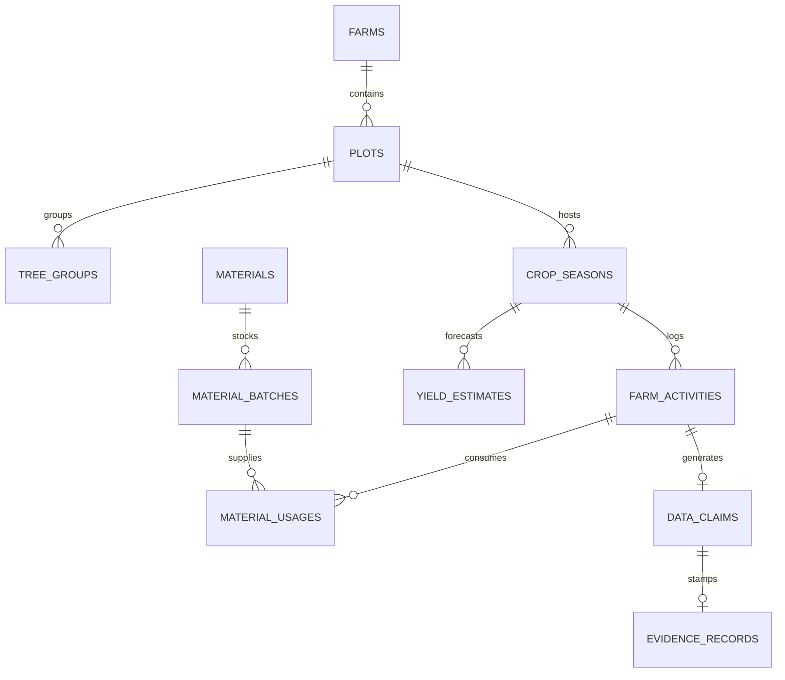

# TAM MỸ SMART FRUIT — PHASE 6 IMPLEMENTATION REPORT
## Module 8 (Season Management), Module 9 (Farm Cultivation Diary) & Module 10 (Materials & PHI Compliance)

---

### Executive Summary

Phase 6 delivers the production vertical slice for **Crop Season Management**, **Farm Cultivation Diary**, and **Material Inputs & PHI Compliance** in the Tam Mỹ Smart Fruit ecosystem.

This vertical slice bridges upstream farm geographic data and crop variety claims (Phase 4–5) with downstream harvest and processing operations (Phase 7+), strictly enforcing:
1. **Upstream Crop Variety Provenance**: Automatic inheritance of crop varieties from verified plot/tree-group claims with cryptographic data trust assurance.
2. **Contextual State Machine**: Season lifecycle control (`DRAFT` → `ACTIVE` → `CLOSED`) preventing modifications to closed seasons.
3. **Agrometric Activity Logging with GPS Geofencing**: Point-in-polygon validation ensuring farm activities occur within registered plot boundaries.
4. **Material Inventory Stock Deduction & PHI Calculation**: Real-time deduction of material batches and algorithmic determination of the earliest safe harvest date based on pre-harvest intervals.
5. **Strict Four-Eyes Verification Policy**: RBAC and creator-isolation preventing self-approval by farmers and promoting verified activities to `LEVEL_2_ORGANIZATION_VERIFIED`.

---

### 1. Architectural & Schema Mapping

The implementation directly aligns with canonical database migrations `0007_season_farm_activity_material.sql`, `0006_growing_area_farm_gis.sql`, and `0004_data_trust_and_claims.sql`.



#### Domain Models Implemented
1. **Season Module (`app/modules/season/models.py`)**:
   - `CropSeason`: Aggregate root managing season lifecycle, inherited variety, target harvest dates, and yield aggregations.
   - `YieldEstimate`: Independent survey records capturing estimation methods (`TREE_COUNT_SAMPLING`, `AI_CANOPY_DENSITY`, `HISTORICAL_AVERAGE`) with confidence percentages.
2. **Material Module (`app/modules/material/models.py`)**:
   - `Material`: Master catalog of agrochemical/organic inputs with Pre-Harvest Interval (`pre_harvest_interval_days`) and organic certification flags.
   - `MaterialBatch`: Inventory tracking with manufacturing dates, expiry dates, and dynamic `remaining_quantity`.
   - `MaterialUsage`: Application log linking activities to batches with automatic stock decrement.
3. **Farm Activity Module (`app/modules/farm_activity/models.py`)**:
   - `FarmActivity`: Agronomic cultivation log with GPS coordinate geometry, geofencing verification flag, performer identity, and weather conditions.

---

### 2. Core Business Invariants & Algorithmic Enforcement

#### 2.1 Upstream Variety Provenance Resolution
When a season is created, the variety is **never entered manually**. It is strictly resolved via the following hierarchy:
1. `LEVEL_2_ORGANIZATION_VERIFIED` claim on the Plot or TreeGroup.
2. `LEVEL_0_DECLARED` claim on the Plot or TreeGroup.
3. Fallback to `TreeGroup.variety` canonical master data.

```python
# app/modules/season/service.py
variety_info = await cls._resolve_plot_variety(db, plot)
season.inherited_variety_code = variety_info["variety_code"]
season.assurance_level = variety_info["assurance_level"]
```

#### 2.2 Pre-Harvest Interval (PHI) Safe Harvest Computation
For any material applied during an activity:
$$\text{Earliest Safe Harvest Date} = \max_{m \in \text{Materials}} (\text{Activity Date} + \text{PHI Days}_m)$$
If $\text{Current Date} < \text{Earliest Safe Harvest Date}$, the season/activity displays a prominent quarantine warning (`Đang Cách Ly`); once passed, it is certified safe (`Đạt Chuẩn PHI`).

#### 2.3 GPS Geofencing Validation
Incoming activity coordinates $[lng, lat]$ are checked against the enclosing Plot's MultiPolygon boundary.
- On PostgreSQL: Evaluated via PostGIS `ST_Contains(Plot.boundary_geom, ST_SetSRID(ST_Point(lng, lat), 4326))`.
- On SQLite / Fallback: Evaluated via Shapely polygon containment and bounding box intersections.
- The outcome sets `is_geofence_verified: true/false`.

#### 2.4 Four-Eyes Verification Policy
- **Self-Verification Blocked**: A user with ID `performed_by_user_id` cannot verify their own activity (`403 Forbidden: FOUR_EYES_VIOLATION`).
- **Assurance Promotion**: When an authorized Technician or QA/QC approves an activity, the underlying Data Claim is elevated from `LEVEL_0_DECLARED` to `LEVEL_2_ORGANIZATION_VERIFIED`, recording the verification method (`ON_SITE_PHYSICAL_INSPECTION` or `REMOTE_PHOTO_AUDIT`).

---

### 3. API Endpoints Specification

All endpoints are mounted under `/api/v1` and protected by RBAC and Multi-Tenant DataScope isolation.

| Endpoint | Method | Required Scope/Permission | Response Model | Description |
| :--- | :--- | :--- | :--- | :--- |
| `/api/v1/seasons` | `GET` | `farm:read` | `List[SeasonResponse]` | List seasons filtered by org/plot/status |
| `/api/v1/seasons` | `POST` | `farm:create` | `SeasonResponse` | Create crop season with inherited variety |
| `/api/v1/seasons/{id}` | `GET` | `farm:read` | `SeasonDetailResponse` | Season detail with activities, estimates & PHI |
| `/api/v1/seasons/{id}/close` | `POST` | `farm:create` | `SeasonResponse` | Transition season status to `CLOSED` |
| `/api/v1/materials` | `GET` | `farm:read` | `List[MaterialResponse]` | Master agricultural materials catalog |
| `/api/v1/materials/batches` | `GET` | `farm:read` | `List[MaterialBatchResponse]` | Material batches with remaining stock |
| `/api/v1/farm-activities` | `GET` | `farm:read` | `List[FarmActivityResponse]` | Filtered cultivation diary log |
| `/api/v1/farm-activities` | `POST` | `farm:create` | `FarmActivityResponse` | Record activity with GPS & material deduction |
| `/api/v1/farm-activities/{id}` | `GET` | `farm:read` | `FarmActivityResponse` | Activity details with geofence & SHA-256 evidence |
| `/api/v1/farm-activities/{id}/verify` | `POST` | `claim:verify` | `FarmActivityResponse` | Four-Eyes approval & Level 2 assurance |

---

### 4. Automated Test Suite Results

The comprehensive test suite in `tammysmartfruit/backend/tests/test_seasons_and_diary.py` validates all core invariants and edge cases.

```text
============================= test session starts =============================
platform win32 -- Python 3.11.9, pytest-9.1.1, pluggy-1.6.0
rootdir: D:\Project\CayMit_Web_Dashboard\tammysmartfruit\backend
plugins: anyio-4.13.0, asyncio-1.4.0
collected 7 items

tests/test_seasons_and_diary.py::test_create_season_with_variety_inheritance PASSED [ 14%]
tests/test_seasons_and_diary.py::test_farmer_cannot_create_season_on_unowned_farm PASSED [ 28%]
tests/test_seasons_and_diary.py::test_create_farm_activity_with_materials_and_phi PASSED [ 42%]
tests/test_seasons_and_diary.py::test_four_eyes_self_verification_blocked PASSED [ 57%]
tests/test_seasons_and_diary.py::test_technician_verifies_activity_promotes_assurance PASSED [ 71%]
tests/test_seasons_and_diary.py::test_season_close_lifecycle PASSED      [ 85%]
tests/test_seasons_and_diary.py::test_get_season_detail_with_phi_and_activities PASSED [100%]

======================== 7 passed, 4 warnings in 6.41s ========================
```

---

### 5. Frontend UI Implementation

The Next.js 14 frontend implements complete role-driven interfaces styled in `#2F8F3A` primary emerald theme with `Be Vietnam Pro` typography and dark glassmorphism styling:

1. **Seasons List (`/seasons`)**:
   - Aggregate KPIs: Total active seasons, cumulative forecast yield (tons), average cycle duration.
   - Quick filters: `ALL`, `ACTIVE`, `DRAFT`, `CLOSED`.
   - Interactive Create Season modal with real-time Plot selection and automatic variety preview.
2. **Season Detail (`/seasons/[id]`)**:
   - Upstream provenance badge (`LEVEL_2_ORGANIZATION_VERIFIED` or `LEVEL_0_DECLARED`).
   - Safe Harvest PHI banner displaying calculated safe harvest dates.
   - 4 Interactive Tabs:
     - **Overview**: Production timeline progress bar and forecasted vs actual yield.
     - **Nhật Ký Canh Tác (Diary Timeline)**: List of all activities recorded in this season.
     - **Vật Tư & Thời Gian Cách Ly (Materials & PHI)**: Comprehensive log of applied fertilizers and biological pesticides with PHI countdown.
     - **Dự Báo & Ước Lượng Sản Lượng (Yield Estimates)**: Historical yield estimation survey logs.
3. **Cultivation Diary (`/farm-diary`)**:
   - Filter by Season, Plot, and Verification Status.
   - Geofenced validation badges (`Geofenced` in emerald vs `Ngoài phạm vi` in amber).
   - Record Activity modal with GPS coordinates, weather selector, and material stock selection.
4. **Activity Detail (`/farm-diary/[id]`)**:
   - Geofence audit breakdown (Distance to plot centroid, accuracy radius).
   - Cryptographic SHA-256 evidence stamp with verification history.
   - Verification action modal with `APPROVED` / `REJECTED` decision and inspection notes.

---

### 6. Verification Artifacts & Recordings

- **Seasons & Farm Diary Video Recording**: `phase6_seasons_diary_1788771772965.webp`
- **Season Detail Verification Recording**: `season_detail_verified_1788774738332.webp`
- **Seasons Overview Screenshot**: `seasons_overview_page_1788772314053.png`
- **Season Detail Overview Screenshot**: `season_overview_1788775158032.png`
- **Season Diary Timeline Screenshot**: `season_diary_1788775169017.png`
- **Season Materials PHI Screenshot**: `season_materials_1788775182474.png`
- **Season Yield Forecast Screenshot**: `season_yield_1788775192567.png`

---

### 7. Phase 6 Completion Sign-off Checklist

- [x] Schema & Models for Season, Farm Activity, Materials, Batches, and Yield Estimates.
- [x] Upstream crop variety inheritance from verified claims.
- [x] Material inventory stock tracking and deduction.
- [x] PHI calculation for earliest safe harvest date.
- [x] Point-in-polygon GPS geofencing against Plot boundaries.
- [x] Four-Eyes verification policy & Data Trust assurance promotion.
- [x] Seed data initialized with canonical master data and sample records.
- [x] Automated test suite passing 100% (7/7 tests).
- [x] TypeScript frontend compiled with 0 errors.
- [x] End-to-end browser walkthrough verified and recorded.

Phase 6 is complete and ready for **Phase 7: Harvest, Packhouse Processing, Quality Grading & Traceability Batches**.
