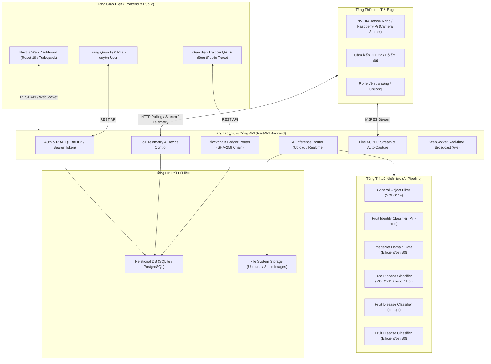
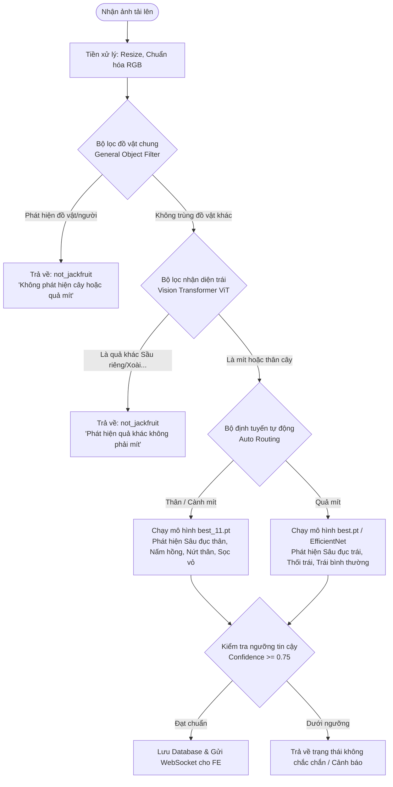

# SYSTEM ARCHITECTURE - TAMMYSMARTFRUIT (PRE-PHASE 2 PROTOTYPE)

> ⚠️ **STATUS: PRESERVED LEGACY SPECIFICATION / HISTORICAL REFERENCE ONLY**  
> Bản lưu trữ nguyên trạng kiến trúc Prototype ban đầu phục vụ nghiên cứu di chuyển và tái sử dụng mã nguồn.  
> **Kiến trúc chính thức:** Vui lòng xem [ARCHITECTURE.md](file:///d:/Project/CayMit_Web_Dashboard/tammysmartfruit/docs/ARCHITECTURE.md).

---

## 1. Sơ đồ Kiến trúc Tổng thể (High-Level Architecture)



---

## 2. Luồng xử lý Chẩn đoán AI (AI Pipeline Architecture)



---

## 3. Kiến trúc Sổ cái Chuỗi khối (Permissioned Blockchain Architecture)

```
+---------------------------------------------------------------------------------------+
| KHỐI 0 (Khởi tạo lô)                                                                  |
| Block Index: 0 | Stage: created | Trace Code: TM-260828-A1B2C3                        |
| Previous Hash: 0000000000000000000000000000000000000000000000000000000000000000       |
| Current Hash : a1f8...39e0                                                            |
+---------------------------------------------------------------------------------------+
                                           │
                                           ▼ (Previous Hash trỏ tới a1f8...39e0)
+---------------------------------------------------------------------------------------+
| KHỐI 1 (Canh tác / Bón phân sinh học)                                                 |
| Block Index: 1 | Stage: cultivation | Actor: HTX Mit Ben Tre                          |
| Previous Hash: a1f8...39e0                                                            |
| Current Hash : 7b2c...881a                                                            |
+---------------------------------------------------------------------------------------+
                                           │
                                           ▼ (Previous Hash trỏ tới 7b2c...881a)
+---------------------------------------------------------------------------------------+
| KHỐI 2 (Thu hoạch & Kiểm định AI)                                                     |
| Block Index: 2 | Stage: harvest | AI Inspection: Healthy (98.5%)                      |
| Previous Hash: 7b2c...881a                                                            |
| Current Hash : 4e99...bf02                                                            |
+---------------------------------------------------------------------------------------+
```

---

## 4. Tích hợp Phần cứng Edge IoT (Edge IoT Integration)

- **Giao tiếp hai chiều (Bidirectional Polling & Push):**
  1. *Telemetry Push:* Thiết bị gửi chỉ số nhiệt độ, độ ẩm lên `/api/sensors` mỗi 30 - 60 giây.
  2. *Command Polling:* Thiết bị định kỳ kiểm tra lệnh chờ (`/api/devices/command/{device_id}`) để bật/tắt đèn trợ sáng hoặc chụp hình.
  3. *Camera Streaming:* Thiết bị stream trực tiếp luồng video MJPEG lên `/api/stream/camera`.
